# Discriminating News-Reading Behavior and Cognition Using Eye-Tracking Methodologies

## By  
## David Stanton

### A dissertation presented to the graduate school of the University of Florida in partial fulfillment of the requirements for the degree of doctor of philosophy

#### University of Florida

2013

[Formatting requirements](http://helpdesk.ufl.edu/application-support-center/graduate-editorial-office/format-requirements/general-requirements/)

---

&copy; 2013 David Stanton

---

To my wife Autumn and my daughters, Lucy and Tabitha, for the strength and support to persevere through late nights and endless edits.

---

# Acknowledgements

I thank my committee for constructive criticism and motivation that helped me become a better researcher and writer. I thank my wife, Autumn, for enduring my time and poverty as a graduate student. Most importantly, I thank my daughters, Lucy and Tabitha, for always having bright eyes and smiling faces when I come home.

---

# Table of Contents

Should be omitted from Markdown and auto-generated afterward.

---

# List of Tables

Table 4.1. Shows the number of participants for each prototype version and media. 70

Table 4.4. Average fixation frequencies are greatest during initial exposure and decrease over time. Changes are significantly larger for the first three 30-second intervals and level off for the remainder of the exposure. 77

Table 4.5. Probability for what type of visual element will be fixated upon next given the participant is currently looking at a text or ASF element. Reported for print prototypes separately and merged together. 79

Table 4.6 Probability for what type of visual element will be fixated upon next given the participant is currently looking at a text or ASF element. Reported for online prototypes separately and merged together. 79

---

# List of Figures

Auto-generate.

---

# Abstract of Dissertation Presented to the Graduate School of the University of Florida in Partial Fulfillment of the Requirements for the Degree of Doctor of Philosophy

# Discriminating News-Reading Behavior and Cognition Using Eye-Tracking Methodologies

## By  
## David Stanton  
## August 2009

Chair: John Wright  
Major: mass communication

News design is mostly governed by tradition and subjective sense. The effectiveness of the traditions becomes increasingly suspect as print newspaper readership falls and digital platforms multiply. The multitude of news platforms beyond traditional newspaper, radio and television requires a new approach to studying news consumers. The current study utilizes eye-tracking methodologies to directly measure reading behavior and, by proxy, glean understanding in cognition of news story forms.

Direct behavioral measurement is crucial to understanding how individuals detect available visual information, parse the categories of information, prioritize information seeking, and cognitively process that information for memory. Self-report methods can be useful for insight into what news consumers believe they want to look at, but only behavioral methods such as eye tracking can reliably show what visual information individuals look at, for how long and in which patterns.

Understanding reading patterns and subsequent cognition is vital for news designers to make efficient and informed choices of how to select story forms, such as text, maps, charts and other imagery, to convey information as effectively as possible. Informed design choices can lower the cognitive load required to detect, parse and prioritize available visual information, which in turn allows more cognitive resources to be available for in-depth processing, learning and storage.

News designers need guidelines to help them utilize story forms to optimally achieve goals. For example, eye-movement patterns can show which visual structures garner attention, which are ignored and which are looked at first. This study compares 200 participants reading news across three, prototype print newspapers and three, prototype news websites.

News prototypes utilizing story forms designed for specific types of information, such as a map to convey geographic information, yielded better learning as measured by a post-exposure, information-recognition questionnaire. There were some inherent behavioral differences between print and online news prototypes, but these effects were overshadowed by story-form choices. Regardless of print, web or other emerging news platforms, a better understanding of how people read and learn from the news will allow news designers to maximize results and minimize efforts.

---

# Chapter 1  
# Introduction

The influx of digital devices into newspaper production and delivery routines is revolutionizing the industry. But this revolution also raises important questions: How do people read these new platforms and story structures? How will people behave given more choices and more control? How can information be delivered to maximize cognition? If research can better understand how people consume and process news information, news companies will be able to create and deliver content that optimally balances the costs of gathering that information with measurable benefits to the consumer. Benefits could include understanding a public-health issue that allows the individual to make more thoughtful civic decisions. Perhaps the objective is for a reader to be exposed to as much content as possible in order to generate advertising revenue. Or maybe the objective is for an information consumer to make a purchase. Some desired outcomes are altruistic and some aim to maximize profit. Whatever the motive, news companies need better guidelines for how to package and deliver information based on content type and desired outcomes. This spans traditional media, the web, mobile devices and other platforms that have yet to emerge.

Newspapers carry a tradition of being interested in the public good in addition to making money (Merritt, 2005). In order to accomplish these dual roles, news companies need a more systematic process to choose how to allocate time, talent and money in an environment of economic uncertainty. In an effort to give a framework to that process, 200 newspaper readers from Southwest Florida were selected to participate in an eye-tracking study and read newspaper prototypes while having their eye movements recorded from July to November of 2006. The findings of how these people read different visual presentations of the same content will provide the foundation for a quantitative decision framework for news design based on the type of information to be delivered and a measurable outcome of success. 

## The Newspaper Industry in Context

The newspaper industry is at a crossroad. It is facing perhaps unprecedented economic challenges. Circulation numbers for daily newspapers had been declining since all-time peaks in the early 1990s. Total paid circulation had dropped 21.6% since that time until the data analysis of the current study. (NAA, 2009). Shares of *The New York Times* were essentially flat over the 18 years from 1990 to 2008, while the Dow Jones Industrial Average had grown four fold before the large drop during the fall of 2008. Over this time period, the Internet came into the public domain and now provides a transmission system for content creators, automated news-filtering application and an infrastructure that gives consumers control of what types of information they want, when and to some extent in what form. Perhaps newspapers are not delivering information in ways that readers want, expect or prefer in this new digital information environment where the user controls what information he or she receives. Individuals are assuming much of the gatekeeping responsibility traditionally handled by newspaper editors (White, 1950; Singer, 2003; Singer, 2005).

Convergence is becoming a stale buzzword. Early in the 2000s, there was a movement to structurally converge newspapers, television and other information media into a single news operation. The movement had minimal success in Florida and even less in states with journalism labor unions (Quinn, 2002). Now information providers create content for many platforms. Instead of merging with a television station, newspapers are producing and distributing original video content through the Internet to websites and mobile devices on their own.

Newspapers are re-defining themselves as information delivery companies rather than printers of paper. But with this immense new toolbox of web, video, audio, mapping, databases, etc., the news industry is in desperate need of metrics to determine resource allocation. Instead of off-the-cuff decisions for using traditional story forms or alternative approaches, publications should be able to use metrics to determine when and how to use story forms and multimedia tools to efficiently achieve a desired outcome such as exposure, recall, recognition, a call to action, sales or other desired outcomes on a story-by-story basis. The current study utilizes print and web-based news prototypes containing many combinations of traditional inverted-pyramid structure, information graphics, maps and other story structures that take time and skilled staff to create. Theories of cognition posit that the density of information and the choices available to the news consumer can affect information processing, storage and retrieval (Lang, 2000; Wise, Bolls &amp; Schaefer, 2008). This study will apply and test this concept to different news story forms using eye-tracking methodologies. News companies need a quantitative decision framework to allow the most effective allocation of resources for hiring staff, developing continuing-education programs, purchasing equipment, and creating and distributing information to better serve news consumers and fulfill traditional journalistic missions. 

## Improving Reading Measures

There have been remarkably few studies utilizing quantitative measures of real news reading behavior (Rhee &amp; Capella, 1997), which can include eye tracking, monitoring heart rate and other physiological measures. Much of the research regarding the behavior and habits of newspaper readers is based on survey and other self-report data (Potter, 2008; Tewksbury, Hals &amp; Bibart, 2008; Geiger &amp; Reeves, 1999). While surveys can answer many questions such as those concerning attitude and affect, introspection is an unreliable measure of behavior and not predictive of future behavior. The ability to gauge a feeling or attitude at any particular moment is difficult. Experimental designs help determine what specific changes within a stimulus cause changes in participant reactions to those stimuli. Generalizing beyond the experiment is difficult because the underlying physiological processes of why people change or respond during an experiment are not directly measured. Validly forecasting how people will react to future scenarios can be improved by incorporating physiological measures in order to more validly measure underlying behavioral and cognitive processes. 

Eye-tracking technologies, originally developed to understand how people look at images (Yarbus, 1967), allow a more direct measure of behavior by using cameras to continually record the movement of eyes during visual exposure. These movements serve as indicators of visual detection and information processing, which in turn influences how messages are mentally stored and retrieved. Eye-tracking apparatuses are used in diverse fields such as neuroscience, linguistics, ergonomics and marketing. Up to now, most of the eye-tracking research done to examine how people read online has been conducted from business and marketing perspectives. These studies are often task-oriented, such as requiring the participant to find a piece of information or complete some activity in an effort to optimize the time to complete the task while keeping a low rate of failure during the task. Jakob Nielsen and the Nielsen/Norman Group probably are the most well-known eye-tracking and usability experts for industry applications (Nielsen, 2006) to measure information-seeking strategies while reading websites. However, their research objectives raise concerns of improperly generalizing findings to news reading. For example, participants may be told what product or piece of information they are looking for, or they may be given a short task list to complete. Some newspaper readers may have a personal set of tasks to accomplish while reading a newspaper. Others may prefer to "discover" the news. They do not always need to fill a specific gap in their knowledge (Tewksbury et al., 2008). Research findings based on a task list should not be applied when the individual is in an information-discovery mode. Likewise, findings on how people browse through information should not be applied to understand a user when there is a specific task to accomplish. Both types of information-consumption behaviors are important but must be conceptually separated.

## Research Approach

The expected outcomes or motivations for reading a newspaper can be different than looking at product information, such as being able to make a better voting decision versus buying the appropriate cell phone. But it is understandable why previous findings have been incorrectly applied to scenarios beyond those used in the research -- the findings were all that was available. Eye-tracking studies to measure reading behaviors are expensive, time consuming and statistically intensive. Businesses selling consumer goods have resources to conduct this research because there is a tradition of supporting marketing research with measurable success goals such as increased sales. Success in newspapers had been measured by winning awards. With falling circulation and advertising revenue, newspaper companies are being forced to balance the traditional public service mission with awareness of which stories generate the revenue that was a given for so many years. Newspapers do not have a history of investing in large-scale quantitative research of he content and design of news. Now, lack of cash makes research undertakings even more difficult to begin although research is more important than ever. That is one of the gaps the Poynter Institute is attempting to bridge with its support of eye-tracking research through funding the data-gathering phase of this project and others. Created by newspaper owner Nelson Poynter in 1975, The Poynter Institute is funded by grants, private donors and the profits of the *Tampa Bay Times* newspaper, the largest independent newspaper in the United States. The Institute exists partly to provide "practical leadership of successful business" for the media industry (Poynter, 2007a).

The Poynter Institute has the financial resources to undertake large research projects because of its mission to improve the journalism industry as a whole (Poynter, 2007a) instead of having to pay shareholders. The current study is based on raw data collected along with the EyeTrack07 project (Adam, Quinn &amp; Edmonds, 2007), the fourth eye-tracking project conducted by The Poynter Institute. In that project, the Poynter team used head-mounted, eye-tracking gear to record eye movements as people read real-world publications including the *St. Petersburg Times* (print and online), the *Minneapolis Star-Tribune* (print and online), the *Rocky Mountain News* (print) and the *Philadelphia Daily News* (print). The EyeTrack07 study was one of the most expensive and expansive quantitative studies of news-reader behavior ever attempted (Adam, Quinn &amp; Edmonds, 2007). Along with real news publications, Poynter also tracked the eye movements of readers exposed to news prototypes. The current study will use these news prototypes as the foundation for a quantitative framework to help content producers more efficiently and effectively package and transmit news to consumers through different media and storytelling structures.

Three print and three online prototypes were created by professional news designers to reflect possible versions of a typical newspaper (or website) story. The first print and online prototypes were designed to represent a traditional approach utilizing a text-based structure with an inverted-pyramid-style lead story. The second versions utilized some alternative story forms such as a map and a fact box in addition to a text story. The third versions contained no traditional narrative elements. These prototype variations helped test how visual story structures relate to information processing, storage and retrieval.

Another unique aspect of this research was the inclusion of sequential and temporal information with content analysis methodologies. Properly describing an individual's exposure to visual information over time requires the preservation of event sequences and the incorporation of dependent observations. Typical content analysis does not account for this information. However, using statistical models, such as Markov chains, allows previous observations to provide useful information to predict future observations within an individual. Behavioral and cognition research has to accommodate previous information when modeling individual responses to media stimuli. One goal of this study is to introduce probabilistic dependence for content analysis methodologies, which traditionally have taken the approach of observation independence. Continually developing analytic tools will help researchers develop new theories and apply existing theories to a media environment where the lines between traditional print, television and radio media are disappearing. Simple measures of exposure to media lose validity when individuals attend to multiple devices and sources of information at the same time. Micro-exposure measures, including the use of physiological measures like eye tracking, quantify which pieces of information within a larger message are actually consumed and processed. Assuming dependence of micro-exposures in a news reading context means an individual is exposed to a small piece of the visual field containing information selected based on underlying cognitive processes. After exposure to one, small piece of visual information, the reader then selects another small piece of the visual field to read. The selection of what to read next is not made in a vacuum. The nature of the visual element currently being read provides information to improve predictions about where the individual will look next.

This study begins to answer how people look at different types of news story structures and describes the behavioral patterns used to consume news information. It addresses questions including: Can news designers use specific visual structures to efficiently communicate information that can be processed, stored and retrieved by readers? What are the mechanisms for how readers come to know what information is contained in news media, and then how do they consume this information? Do readers behave the same regardless of the media, or does the design and content of the media influence the ways readers interact with the media? Can what we learn using physiological measures like eye tracking be utilized with other types of measures to develop more realistic models of news reading?

The hypotheses test how individuals selectively read visual information and the implications of these behavioral patterns for cognition. Scanpath Theory (Noton &amp; Stark, 1971), Feature Integration Theory (Treisman &amp; Gelade, 1980) and Schema Theory (Wicks &amp; Drew, 1991) predict underlying cognitive processes that allow individuals to make quick judgments as to the information available in the visual field. These heuristic judgments are based on the attributes of discrete visual structures. Readers spend time scanning and detecting all available information before selecting specific pieces of visual information. So, time during initial exposure will consist of scanning and detecting what type of information is available. After selecting and processing a portion of the visual field, individuals will select another portion of the visual field probabilistically determined in part by their current location of gaze. As the length of exposure increases, more time will be allocated toward reading and processing the visual field instead of detecting what information is available. This increase in processing and decrease in detection time is a manifestation of individuals creating mental maps that describe and associate information within the visual field. Using design to provide heuristic clues as to information contained within a visual structure, such as geographic information contained within a map, the amount of time and cognitive resources allocated toward detection and selection is decreased, and instead more cognitive resources are allocated to processing and storing information in memory.

The limited number of combinations used in one study will not provide results that will apply to all news reading. Instead, the primary objective of this study is to provide valid justification for using specific types of visual structures to communicate specific information most effectively. The results provide foundational models for how specific story forms often used in news design are selected, parsed, processed and stored in memory. Future research must build upon this macro design framework to understand how specific combinations of story-form type, size and orientation can allow reliable predictions as to configurations of these attributes that maximize information retention and minimize the costs of production. As an example, news designers should have a quantifiable justification for the size, shape and orientation of a photograph and caption text. All design choices come with tradeoffs. A photograph could be set to run at a specific size based on the information and importance. However, this increase in photograph size means other information structures must be resized, deleted or moved within the visual field. This tradeoff should be made intelligently based on an overall increase in information retention, positive attitude toward the information, or some other metric of success for the information conveyed within the visual field.

Hopefully other researchers will be able to use the analytic tools and conceptual framework developed in this study as a starting point to quantify news design. Whether they work for newspapers, television stations or as independent content creators, all information producers can benefit from a more systematic and quantifiable approach to making design choices. News design should prioritize consumer uses and needs for information. There will and should be room for design creativity, but the primary objective of news is to convey information to readers or viewers. This primary objective should be the focus of news design.

---

# Chapter 2
# Literature Review

Developing a valid framework for efficiently designing and delivering news content requires a theoretical understanding of how individuals consume and think about visual information. Because this study utilizes eye-tracking measures, the first responsibility is to describe the rationale for using behavioral measures as valid proxy measures for cognition. After this proxy relationship is detailed, a theoretical cognition framework for how people detect, select, process and store information will be discussed as it relates to news design. The cognition framework will describe how information is stored in memory and conceptually linked based on prior experiences and to fit within underlying mental constructs. Understanding the processes of vision and cognition will allow news designers to utilize underlying mental constructs to lower the cognitive effort to parse and assimilate new visual information.

Directly measuring cognitive processes can be accomplished through brain imaging techniques such as functional magnetic resonance imaging (fMRI). However prohibitive costs and tightly controlled testing environments make direct cognitive measures impractical for widespread use and replication by academics and, more importantly, news producers themselves. Researchers have more commonly utilized physiological measures like heart rate (Lang, 2000; Wise et al., 2008) and eye movements (Garcia &amp; Stark, 1991; Lewenstein et al., 2000; Outing &amp; Ruel, 2004; Adam et al., 2007; Bucher &amp; Schumacher, 2006; Holsanova et al., 2006) as behavioral indicators of underlying cognitive processes. Essentially, using behavioral and physiological measures can be proxy measures for cognition. This literature review builds a case that eye movement, as measured by eye-tracking hardware, is a reliable and valid proxy measure for cognition.

Once visual information has been consumed, the brain processes, sorts and stores pieces of that information based on underlying constructs. Visual design of information should influence how efficiently a message can pass through the different stages of cognition. The number of choices and the types of available choices should affect how a person consumes visual information. The types of visual structure used to transfer information, whether plain text, charts or maps, should affect how well specific types of information can be processed, stored and later retrieved. Finally, the types of information individuals seek or find interesting should not necessarily be uniform. Education, media usage and other life experiences could alter how people view and process visual information. There are many ways to tell a story or convey information. A theoretical understanding of the vision process and the underlying cognitive schemas used to organize information in the brain will serve as the basis for a framework to allow communication scholars and practitioners to make more informed design and delivery choices.

## Eye Movements

In order to understand the process of eye tracking, one first must understand some basics about the process of eye movements as well as the common definitions (Chaffee, 1991). Essentially, eye tracking is a collection of methodologies used to record eye-movement data (Cooke, 2005). Implementation requires the use of hardware and software to record these movements and generate data in a form usable for analysis. These data are composed of fixations and saccades. Fixations are defined as "pauses over informative regions of interest" within a stimulus (Salvucci &amp; Goldberg, 2000, p. 71). These pauses are assumed to allow the mind to take a visual snapshot of a limited visual field, typically the size of a quarter on a flat stimulus held at arm's length from a person (Cooke, 2005). Fixations "indicate one's spatial focus of attention over time" (Josephson, 2004). The minimum duration of a single fixation can vary depending on the image density of a stimulus or display (Goldberg &amp; Kotval, 1999), but common operational definitions for fixations do exist. Josephson and Holmes (2002) use 100 milliseconds as the minimum amount of time necessary for the eyes to look at a single position before a fixation is counted as being indicative of information processing. Others use a longer duration of 250 milliseconds (Rayner, 1978; Pan et al., 2004). Researchers using other physiological measures, such as heart rate, have shown an orienting response can occur as fast as 50 milliseconds. However, visual information held in temporary storage for less than 300 milliseconds is not passed for further processing (Lang, 2000). Therefore, a 300-millisecond threshold is justified for measuring eye movements indicative of cognition and reducing data noise. Eye-movements that occur faster than this threshold are not passed for cognitive processing.

Fixation duration, or the cumulated time spent on one element before moving the eyes, is an indicator of the depth of information processing (Juhasz &amp; Rayner, 2003). It is assumed that the longer an individual spends looking at something, the more complete the information processing, encoding and storage. When a fixation ends, the eyes undergo a saccade. Saccades are rapid, jerky movements of the eye that take place between fixations (Rayner, 1978; Pan et al., 2004), or "shifts of gaze produced by the oculomotor system" (Petit et al., 1996, p. 153). These movements typically last for 25 to 30 milliseconds (Williams, et al., 2005; McConkie &amp; Loschky, 2002). Although saccades are not directly of interest for eye-tracking research, it is important to understand what happens between fixations. One could incorrectly interpret these small movements and twitches as informative and indicative of attention. Saccadic movements essentially fill the gap between the end of one fixation and start of another.

The transition from a moving eye (saccade) to a stationary eye (fixation) is not instantaneous. The eye gradually slows, perhaps overshooting the target and returning to a desired fixation location (Wiener, 1948). Saccadic movements occur in less time than the orienting-response threshold of 50 milliseconds often used for physiological measures (Lang, 2000; Wise et al., 2008), so it is assumed that visual information processing pauses during saccades (Salvucci &amp; Goldberg, 2000). Williams et al. (2005) suggests this temporary shutdown of vision is to prevent the blur that would occur as the eyes realign. Without this pause, visual information would be coming too fast to be processed. Instead of the brain having to filter out the extra visual noise introduced by overloaded vision, the path of fixations across a visual field resembles a series of quick cuts instead of panning from location to location, to use analogies from motion pictures. Visual processing pauses until the eye is stable for long enough to generate an orienting response at approximately 50 milliseconds. Between 50 milliseconds and 300 milliseconds, visual information is held in temporary memory to allow detection. During fixations lasting longer than 300 milliseconds, information is passed from temporary memory for cognitive processing, encoding and storage. It is important to understand the physiological processes of eye movements because these biologically constrained movements describe a serial pattern for looking at a visual field. News readers cannot see everything at once. The eyes fixate and process one location approximately the size of a quarter coin on a surface at arm's length from the eyes. Readers utilize cognitive mechanisms to prioritize which regions to fixate first and then where to go next. These mechanisms determine how to allocate visual attention.

## Visual Attention

Individuals have cognitive mechanisms that prioritize which small piece of all available information should be processed first and which pieces should be subsequently processed. Visual attention describes the prioritizing of available visual information that generates an orienting response. Although eye tracking is a relatively young methodology, research of eye movements and visual attention predate the creation of hardware measurement. Von Helmholtz (1950) noted a belief that giving visual attention to objects was tied to perception of those objects. Eyes roam through a scene, or visual field, to pay attention to specific details within that visual field. Direction of eye movement indicates the interest of cognitive processing for an individual (Zhu &amp; Ji, 2004). Duchowski summarizes that "although visual attention can be consciously directed to peripheral objects, eye movements reflect the will to inspect these objects in fine detail. In this sense, eye movements provide evidence of overt visual attention" (2007, p. 5). Visual objects are stored in memory with sensory cues that allow that visual object to be later retrieved and applied to visual objects to speed up detection (Von Helmholtz, 1950). James (1981) thought visual attention was a voluntary action to find regions within the visual field that have anticipated meaning or information.

Duchowski (2007) reconciles these constructs as complimentary components of visual attention. Eyes pass over the visual field to compile an awareness of the components within available objects. This scanning procedure is accomplished peripherally, or beyond the biological constraints of the eye to process at a high enough level to allow cognition. Peripheral detection also can be called parafoveal vision. Detailed inspection of the information in a region of the visual field is accomplished through foveal vision. Essentially, foveal vision is directed toward a small area that the brain can dedicate primary attention and information processing capacity (Reingold &amp; Loschky, 2002). Central foveal vision is biologically restrained, based on the arrangement of rods and cones in the eye, within a 1- to 5-degree visual angle from the eye toward the visual field (Duchowski, 2007). This region is approximately the size of a quarter at an arm's length from the eyes. This area of central visual attention is used at the calibration threshold for many eye-tracking devices. These considerations will be detailed later.

The types of visual objects available are peripherally scanned with prior experience influencing which objects are detected as being of interest. This explicit separation of foveal and parafoveal vision is crucial to understanding the utility of eye tracking as a proxy measure for cognition. Newsreaders cannot look at everything at once. In-depth processing can only occur through foveal vision. Individuals must make choices of what to look at in what order. The ability to attract the attention of a newsreader is valuable. The ability to determine which visual structures reliably draw attention is tremendously valuable. A prime example is to have a quantifiable reason for displaying a photograph in a larger size versus a smaller size. Using a larger photograph instinctively seems like it should grab more attention because of the larger proportion of this structure within the overall visual field. However, this choice affects the rest of the visual field. Some other content must be resized, reformatted or eliminated. Perhaps the overall visual attention given to the combined elements is increased or perhaps it is decreased. News designers do not have valid answers for this. This design choice has quantifiable implications that need to be explored.

## Selection

Visual attention draws the eyes. Some process must then filter the different objects of interest to a single visual object that is selected for higher-order processing. Broadbent (1958) posited that information entering the brain is run through a "selective filter" that determines which messages are important and which are unimportant or simply background noise. This is an application of the Information Theory of Shannon and Weaver (1949) where a signal passes from sender to receiver while becoming noisy during transmission. The amount of information and the number of simultaneous channels between sender and receiver affect how accurately the receiver processes information. Broadbent (1958) was interested in how people select particular sounds when there are multiple people talking and with non-informative background noises. He wrote that humans have limited cognitive capacity and therefore attend to only one message at a time or risk high error rates in receiving the information. Although his research focused on sound, he states there should be no theoretical restriction of why a "selective filter" would not be used by other senses such as vision. For this study, this selective filter would allow a newsreader to see one piece of the visual field at a time. This would be akin to only allowing foveal vision to be useful. However, parafoveal, or peripheral, vision plays an important role in detecting what visual information is available.

Although only one piece of the visual field can be fixated for processing, the other available visual structures do provide heuristics of available information to allow an individual to create a prioritized ranking of the most important messages. Deutsch and Deutsch (1963) described "importance weightings" as an alternative to Broadbent's "selective filter" construct. They argued that all information is processed at the highest level with weightings applied to information to determine what information is processed further. An example might be standing in a crowded room. You could pay attention to each face equally, locate a specific face based on a preconception of importance, and then pay attention to comprehending the details of that face. These two processes cannot be directly integrated. The "selective filter" only allows one message to be attended to at a time because attending to simultaneous messages prevent accurate detection and selection for further processing. The "importance weighting" model requires simultaneous attention. Treisman (1964) reconciled these two constructs by proposing an "attenuation filter" that does not block unwanted messages but instead quiets them. While an individual can only attend to one message at a time, the individual is still aware other messages exist and can be later selected. The process of message selection should work similarly for audio and visual messages. Visual objects are peripherally detected and selected based on preconceptions of importance. The eyes fixate on a selected visual object, and foveal vision begins. Once a fixation has passed the 300-millisecond threshold, visual information is passed for cognition.

Applying Treisman's "attenuation filter" to news reading, an individual can allocate foveal gaze to one area of the visual field while maintaining an awareness of the other visual structures located within the visual field. The individual cannot process these peripheral structures to determine the types of information. A paragraph of text is easily identified, but there are no clues as to what information might be contained within. A map, however, can provide visual structure readily identifiable: this structure will contain geographic information. Attributes of the visual structures provide clues as to the information that should be or could be contained. These visual cues can help newsreaders take inventory of available information with less cognitive effort. This, in turn, should allow for quicker information prioritization. Less time detecting and prioritizing available information means newsreaders can allocate more time and cognitive resources toward processing and learning information.

## Cognition

Clearly the eyes and mind do not act as distinct entities but in a cooperative manner. Theories describing vision and cognition tend to separate events of automatic response from cognition. The previous section described behaviors such as orienting responses as nearly automatic reactions to stimuli based on inherent physiology and previous experiences. However, cognition is the combination of processes whereby information is parsed, organized based on characteristics of that information, encoded to allow future access and finally stored in memory. Cognition involves learning from information instead of merely being alerted to the presence of information.

Alfred Yarbus conducted some of the first eye-tracking research during the 1950s as an effort to understand how people processes complex images by a cognitive assembly of smaller parts. He asked questions related to an image and recorded eye movements as the subjects processed the image to solve questions (Yarbus, 1967). Noton and Stark (1971) built on the work of Yarbus and used the term "scanpaths" to describe the eye movements of individuals as they construct the entirety of the visual field, or image, through sequentially viewed chunks or regions. Duchowski (2007) said that the Noton and Stark "Scanpath Theory" results support a process of visual attention where specific regions of interest to an individual are looked at in a serial manner via foveal vision for more detailed processing. Posner, Snyder and Davidson (1980) described this ability to shift attention as a "spotlight" mechanism. This concept is the visual equivalent to the "attenuation filter" Treisman (1964) proposed for how people selected specific sounds to process by quieting the non-important noise signals. A person can begin to process visual information from a small portion of the visual field by directing foveal vision to that area of interest. The other available visual information is muted or darkened so that peripheral, or parafoveal, vision can be used to detect visual structures but only foveal vision is used as the pathway from the eyes to the mind. Treisman and Gelade (1980) unified the "scanpath" and "spotlight" mechanisms to describe the entire processes for a person to detect what is available, direct primary attention to small regions and integrate these snapshots to create a complete mental version of the visual field.

The "Feature Integration Theory" of Treisman and Gelade describes how an individual assembles the small pieces gathered one at a time into a singular, mental representation of the whole visual field. Schema Theory (Wicks &amp; Drew, 1991) describes how information is broken apart, categorized and stored within memory. Together, these two theories provide a way to relate what newsreaders see within the visual field with what information they process and store in memory.

### Feature Integration Theory

Von Helmholtz (1950) said that the brain uses visual cues to efficiently select items of interest from a visual field full of information. Treisman and Gelade (1980) developed Feature Integration Theory to describe how the mind can use visual attributes of color, size, positioning and distance as shortcuts to detect what information is available, select the most salient information and then evoke prior experiences to process and assimilate this information. Upon exposure to a visual field, a person creates an "immediate impression of recognizable objects, organized coherently in a spatial framework (Treisman &amp; Gelade, 1980, p. 97). FIT posits that a parallel strategy registers all visual elements using heuristics of visual attributes to anticipate the types of content available in various visual structures. A serial mechanism then is utilized to look at visual elements one at a time if they are not easily recognizable. During this stage, individual elements also are grouped together to assemble a larger unit, such as photograph and the text caption being cognitively grouped as part of a larger but cohesive content unit. These groupings are referred to as "conjunctions" (Treisman et al., 1977). News designers could find great utility in having the reader create these conjunctions, which should speed up detection of all visual elements on a page in order for the reader to select information of primary saliency. However, attention overload creates "illusory conjunctions" and slows selection because more cognitive resources are required to undo these false associations. Some individual visual elements with very strong informational associations become inseparable for detection (Treisman &amp; Gelade, 1980). A map of the United States of America is comprised of 48 touching states, plus Alaska and Hawaii. Many of these states are quickly recognizable if they existed in visual isolation. When presented together as a single map, FIT says that all states effectively become a single visual element for visual detection.

### Schema Theory

The Feature Integration Theory describes how previous experiences and visual attributes help people discern visual elements. However, FIT does not explain the recursive process of how experience is encoded to allow faster detection during a future exposure to visual information. Schema Theory fills this hole. Fiske and Taylor (1984) described a schema as a structure allowing for organization of information. Cognitive schemas allow for information to be stored within an individual's memory in an organizational structure abstracted from prior knowledge and experiences (Wicks &amp; Drew, 1991).

When individuals are exposed to new information, and assuming cognitive processes have activated, individuals "attempt to assimilate it into an existing schema" (Wicks &amp; Drew, 1991, p. 156). No individual piece of information describes the entirety of the topic. FIT describes how parts of the visual field are mentally stitched to create a whole. Schema theory describes an analogous process of how individual pieces of information are systematically stored with other pieces of related information to create a more complete understanding or knowledge within an individual. Schemas are used in the physical world as well as the brain. Libraries utilize schemas to shelve books of similar topics together. There are numerous other ways to sort, such as alphabetically by title or perhaps based on publication dates. However, alphabetical and chronological sorting are fundamentally inferior to organizational schemas based on subject areas if the primary objective is to store collective knowledge for future retrieval that allows an individual to find all information necessary to understand a specific topic or make a decision. So, think of cognitive schemas as structures that allow for multiple associations between pieces of information. These associations allow the brain to quickly retrieve and compile a whole of the individual's knowledge as a response to a stimulus or event. When reading news related to a disease, the individual retrieves learned information, assimilates new information and then stores this improved understanding. Simply, humans learn from exposure to information. They do not have to approach each situation or stimulus as a blank slate. For journalists and news designers, structuring information that naturally matches underlying schemas should allow for information to be more easily stored to memory.

Schemas need not be fixed. Schema theory suggests that processed information that fits consistently within evoked knowledge structures, or schemas, reinforce that schema and make it more useful for storage and later retrieval of information. Conversely, new information may require a modification to an existing schema or the generation of a new schema altogether. One schema may allow effective storage and retrieval of geographic information but simultaneously be ineffective for temporal information. Schemas are optimized for specific classes of information, or semantic categories, such as time, location and proportions. News creators that design and deliver information fitting most consistently with underlying cognitive schemas should allow news consumers to more efficiently assimilate the news with existing knowledge.

Rosch (1975) found that the structure of organized memory had clear relationships with the ways information within semantic categories is processed. A comparison between text and photographs showed less time was required to match photographs of like content than text of like content (Posner, 1969). This suggests photographs "may be closer to the nature of the underlying representations of superordinate categories" (Rosch, 1975, p. 192). Rosch suggests that the structure of semantic categories has implications to how "concept attainment" or cognition should be studied. For news designers, the structure of semantic categories should be a primary factor driving how different types of information are packaged and transmitted to news consumers. For example, pie charts are used to show the proportions, such as the proportions of male or female students in a high school. Other common semantic categories utilized in news design are geographic, temporal and scalar comparisons. Maps visually represent a semantic relationship that some items exist in relative position to other items. Timelines represent comparisons of time. Line charts represent how the value of something changes with respect to another variable. These different visual structures allow the brain to anticipate what type of information and comparisons may exist during detection and reading-priority assignment. News designers will benefit from quantifiable understanding of how different visual structures affect schema creation and modification.

Semantic categories can be thought of as constructs or "bounded entities, whose membership is defined by an item's possession of a simple set of criterial features, in which all instances possessing the criterial attributes have a full and equal degree of membership" (Rosch, 1975, p. 193). So, attributes of information provide cues as to what types of underlying concepts are contained and prompt cognition mechanisms to efficiently parse, process and store that information. Rosch also found that the underlying structure of semantic categories can be altered through practice. So, while there may be some visual structures that are innately understood as containing specific types of information, other visual structures become more readily recognized through repeated exposure. There are two primary implications for news designers. First, information should be designed with the news consumer in mind. Visual structures should have innate and obvious visual cues as to the contained concepts. For example, a map should be used for geographic information and not chronological information. Second, design consistency should help the news consumer practice how to process visual structures without such obvious cues as a map. News elements such as a caption accompanying a photograph do not have the obvious visual cues as to what kind of information is contained. However, consistently positioning captions in proximity to the related photograph should help the news consumer learn that this discrete visual structure, the caption, is providing information related to the photograph.

An individual has finite cognitive resources to allocate toward detection and processing of visual information. Cognitive resources used for recognizing visual structures are resources that cannot be allocated toward processing. So, it seems logical that news designers should utilize visual structures that make information in the visual field quick and easy for the news consumer to detect. Sometimes the structure may be obvious. Often the optimal visual structure is not obvious. Particularly when not obvious, visual structures should be consistently used to transmit information that falls into the same underlying semantic categories. This consistency gives the news consumer experience and practice in using a visual structure, and the practice should make future experiences with similar visual structures more cognitively efficient.

## Motivations

Finding an optimal visual structure to aid detection and cognitive processing assumes that individuals have equivalent previous life experiences with information structures and equivalent motivations to read and understand the information. Wigfield and Guthrie found reading habits are driven by self-efficacy, intrinsic-extrinsic motivations and social dynamics (1997). Although these constructs are not measured in this study, and are controlled through the experimental design, a brief overview is necessary. The holistic nature of reading behavior and cognition is both a product of the currently viewed visual stimulus but also as a culmination of all prior reading experiences.

Motivations are conceptually connected to self-efficacy, or a person's perceived strength of their own effectiveness within a specific situation or context (Bandura, 1977). For news reading, as well as for reading scientific or technical content, an individual's self-efficacy could have an impact on looking at the reading situation as an avenue for learning and discovery or to dread it as encountering unfamiliar information they perceive as difficult to understand. Perceived self-efficacy then influences an individual's motivations toward reading and learning.

Wigfield and Guthrie (1997) describe intrinsic motivations as those motivations that an individual has such as a personal interest in a topic and perceived value to himself or herself for understanding new information or successfully completing a task. Eccles et al. (1983) similarly defined these concepts as components of task value. Extrinsic motivations include outward goals of looking smart in front of others or doing something as competitive activity to best others. Related to extrinsic motivations are other social aspects of motivation. Some individuals exist within social spheres that encourage specific motivations while discouraging others.

Within a news-reading context, intrinsic motivations include reading news to understand the world at large or a specific topic related to the individual. An intrinsic motivation for reading news related to a health issue could be to more fully understand the topic in order to make a more-informed decision at a later time. Conversely, extrinsic motivations for news reading are to appear to others as well informed. Perhaps the information can be used during everyday conversions in an effort to increase the individual's perceived intelligence by others. Clearly these two categories of motivations are not mutually exclusive. Some content may be personally interesting because of a specific hobby, activity or utility. Likewise, there can be extrinsic motivations for reading the same content, such as being perceived as an opinion leader within a community or public sphere dedicated to that hobby or interest. Social pressure could encourage reading specific information because of a perceived need to be informed, such as global warming, Middle East politics or derivative securities.

Motivations, both intrinsic and extrinsic, influence how an individual consumes and processes information (Guthrie et al., 2000). These motivations are both a function of internal values and goals as well as the values and goals of the various public spheres within which a person lives, works, plays, learns and communicates. Individuals that make behavioral choices based on intrinsic motivations, or task values, have been found to make decisions based on the utility of learning and allocate more leisure time toward reading (Durik et al., 2006). Other research has suggested that interest toward a specific message, an intrinsic motivation, yields a reduction in the knowledge gap between individuals differing educational levels (Kwak, 1999). This motivation contingency model (Viswanath et al., 1993) is a modification of the knowledge gap hypothesis described by Tichenor, Donohue and Olien (1970).

The knowledge gap hypothesis says an individual of higher socioeconomic status acquires information faster than an individual of lower status, so each media message contributes to a widening gap between the knowledge levels of the two individuals. The motivational contingency model suggests that individuals with less formal education can acquire more knowledge when intrinsically motivated than an individual with more education but less motivation. Kwak (1999) also found a significant three-way interaction between an individual's interest in a topic, media usage and the amount of knowledge acquisition. In the Kwak study, individuals with high interest in newspapers and high interest in a topic had similar knowledge scores, regardless of the level of formal education. These results should provide incentive for news designers to think about making content, whether it text, audio, video or a combination, interesting for news consumers. Providing content in forms that fit with the expectations and interests of news consumers should yield greater knowledge acquisition than having content fit into an arbitrary storyform.

The current study does not attempt to measure motivation, but a demographic comparison between participants of different educational levels could be interesting. There is no reason to suspect some people will learn more efficiently from online versus print newspapers. Visual structures transmitted through a platform have implications for cognition, but the platform itself should not matter. A two-dimensional surface is basically the same whether that surface is created from paper, plastic, metal or other materials. However, the capabilities of an online newspaper to utilize a more diverse range of visual structures could yield more efficient cognition. Another possibility is that people with different levels of education or motivation will react differently to the same visual structure. Although these questions are controlled by the experimental design of the current study, future research certainly should investigate these issues.

## Hypotheses and Research Questions

Eye movements include fixations and saccades. Counting a fixation requires the eye to remain stable for some amount of time before viewing the visual field switches from detection to cognition. During vision but before a fixation is registered, the eyes and mind are trying to inventory what types of visual information is available based on heuristics or shortcuts. Previous experiences as described by Scanpath Theory (Noton &amp; Stark, 1971), Feature Integration Theory (Treisman &amp; Gelade, 1980) and Schema Theory (Wicks &amp; Drew, 1991) predict that visual information from previous experiences are stored and categorized within the mind to allow for faster detection of available information in future viewing scenarios. These underlying schemas and related cognitive maps should speed detection of visual structure as proxy for detecting the available information within the visual field. If this is true, then an individual would not need to allocate the same amount of time and cognitive resources for detection to all regions of the visual field in order to choose what information to fixate upon for further cognition. Individuals will use previous experiences and personal interests to select areas of the visual field instead of looking in a random fashion. Therefore,

> H1: Visual elements, or structural types of news content, on a stimulus will not have equal probabilities of being fixed upon by the reader.

Schema theory (Wicks &amp; Drew, 1991), in particular, posits that information acquired through cognition is parsed, or separated into smaller pieces of the whole, and stored in memory based on conceptual linkages that allow for faster retrieval of related information when needed as well as faster storage of newly acquired information. These speed gains should be the result of fewer finite, cognitive resources being allocated toward parsing visual information. Surplus cognitive resources will be directed toward storing information based on underlying cognitive schemas. Visual structures restricted to the fewest categories of information, such as geographic, time or ordering, should allow more cognitive resources to be allocated toward storage of information with fewer cognitive resources allocated toward parsing that information during the stages of cognition. If this is true, news design prototypes that maximize storage and minimize parsing should yield better scores when individuals are quizzed after exposure.

> H2: Readers given prototype news pages that utilize smaller, discrete storytelling elements will perform better information recognition.

Individuals exposed to visual stimuli are constantly optimizing, modifying or creating scanpaths. Items are detected, fixated upon and processed. Every repetition of these steps becomes faster because new information is incorporated into an individual's understanding of what information should be available within different types of visual structures (Treisman &amp; Gelade, 1980). For example, if every photograph within a newspaper or website includes a caption beneath the photo, the individual stores this pattern and can later know that the text underneath a photo is a related caption without actually reading that text and creating this conceptual linkage again. Upon initial exposure to a visual stimulus, an individual should look at many visual structures in rapid succession to create a mental inventory of the available information before selecting a structure for more in-depth cognition. However, after creating this spatial map of the available information, the individual should not have to repeat this detection process during the remainder of exposure to the visual stimulus.

> H3a: The frequency of elements fixated by a person will be greatest during initial exposure.

> H3b: The frequency of fixated elements will decrease as exposure time increases.

Beyond the theoretically based hypotheses, there are a tremendous number of exploratory research questions that could be asked of this data. The most obvious is to investigate whether the effects of visual-structure differences on reading behavior and learning are consistent across platforms or strongly determined by that platform. In the context of the current study, will small, discrete visual structures have the same effects for a print newspaper and an online news website? Unfortunately the inherent characteristics of certain platforms, such as hyperlinking for websites, makes a direct comparison impossible. Although the basic task of reading text on a two-dimensional plane seems like it should be consistent across print and online, there is the possibility that inherent characteristics of the platforms change a common task into two divergent experiences.

> RQ1: Will medium or story structure be more important in determining how people read the news?

There are questions of whether demographic variables are important in determining how differently individuals behave and learn when presented with different visual stimuli. Many researchers have shown demographics and social norms are related to motivations toward discovery, learning and behavior toward others based on how individuals are rewarded and punished for different behaviors by peer groups (Hoover-Dempsey et al., 1987; Dodge et al., 1994; Heimer, 1997). Both natural and socially enforced characteristics of individuals could affect how people read and learn.

> RQ2a: How does gender relate with reading patterns?

> RQ2b: How does age relate with reading patterns?

> RQ2c: How does education relate with reading patterns?

> RQ2d: How does self-reported media usage relate with reading patterns?

## Summary

This literature review built a case that eye movement, as measured by eye-tracking hardware, is a reliable and valid proxy measure for cognition. Scanpath Theory (Noton &amp; Stark, 1971) describes how sequences and patterns of eye fixations and saccades allow an individual to see and process a visual field. Physiological constraints of the eyes only allow for a small, central portion of the visual field to be processed. Feature Integration Theory (Treisman &amp; Gelade, 1980) explains how the serial processing of one regional of visual interest followed by another and another can create a singular representation of the entire visual field within the mind. Schema Theory (Wicks &amp; Drew, 1991) posits visual information that passes through the stages of cognition is stored in memory and conceptually linked based on previous experiences with similar visual information and underlying constructs.

Visual design of information that acknowledges the serial acquisition and structural relationships described by these theories should allow a message to more effectively pass through the different stages of cognition. The number of choices and the types of available choices will affect how a person processes visual information. The types of visual structures used to transfer information, whether plain text, charts or maps, will affect how well specific types of information are processed, stored and later retrieved. Understanding the processes of vision and cognition will allow news designers to utilize underlying cognitive schemas to lower the cognitive effort to parse and assimilate new visual information.

Eye-tracking analyses of news are rare. The literature review described several fields related to mass communication where researchers and practitioners have utilized eye-tracking research. In the social sciences, eye tracking has been used to answer questions related to reading, scene perception and visual search (Duchowski, 2003). Industrial engineering applications include ergonomics for airplane cockpits (Wetzel, 1997) and other instrumentation layouts. Scholars of human-computer interaction use eye tracking to conduct usability tests of software applications and virtual reality systems. The most similar application to print and online news have been in marketing and advertising research (Duchowski, 2003). Eye movements have inherent characteristics that are difficult to reconcile with traditional content analysis techniques. However, sequential observations can be analyzed through contingency tables after incorporating Markov chains. The next chapter will describe how fixations can be harnessed as a content analysis tool for print and digital news gazed upon in sequences during free-reading experiments.

---

# Chapter 3
# Methodology

Eye-tracking data is typically recorded and analyzed based on frequencies and durations of gaze fixations as indicative of reading patterns (Holmquist et al., 2003). Most of these eye-tracking implementations use software packages to automatically record fixation and saccades as a means to generate gaze patterns. Software-based coding yields perfect reliability, but areas of interest are designated based on coordinate locations and not through code categories as generally described in content-analysis techniques. Also, the stimuli used for eye-tracking research tend to be limited in scope, constrained to a single page and static. This is because a changing image would cause the same coordinate location to represent multiple objects at different time points of the exposure. By limiting eye tracking to one, static stimulus at a time, there is serious concern about whether findings can be generalized to stimuli that have multiple visual configurations throughout a continuous exposure. The first three eye-tracking studies conducted by The Poynter Institute (Garcia &amp; Stark, 1991; Lewenstein et al., 2000; Outing &amp; Ruel, 2004) satisfy this concern by using news prototypes. While prototypes are optimal to control within-study variables, external validity and generalizability outside of the experimental design suffers (Wimmer &amp; Dominick, 2006). This sacrifice is often made in order to systematically change levels of independent variables across multiple stimuli and examine causal relationship in an experimental setting. However, generalizing beyond the research prototypes is dubious at best and certainly not scientifically defensible.

The Poynter Institute's fourth eye-tracking study (Poynter, 2007b) was the first major reader-behavior study that utilized human coders for content analysis. Adam, Quinn &amp; Edmonds (2007) wanted to analyze news-reading using actual publications, in this case the *St. Petersburg Times* print and online, the *Minneapolis Star Tribune* print and online versions, and the print versions of the *Rocky Mountain News* and the *Philadelphia Daily News*. The number of visual elements was enormous. A daily edition of the newspaper could have thousands of visual elements available for fixation. So, a content-analysis codebook was generated to have human classify elements within defined typologies such as headlines, photos, advertisements and other newspaper design elements.

The current study uses raw video data collected by Adam, Quinn &amp; Edmonds (2007) but not previously analyzed for eye movements. Instead of using real publications, the current study utilizes print and online news prototypes. In conjunction with content analysis, it attempts to uncover the sequencing of news reading and the relationship between reading behavior and learning. This is the first attempt to incorporate content analysis with sequential data for news reading.

## Participants

The Poynter Institute decided to focus its latest eye-tracking project on comparing reading patterns between broadsheet, tabloid and online newspapers. Because the current study uses raw data collected concurrently with the EyeTrack07 study (Adam, Quinn &amp; Edmonds, 2007) the objectives for that study determined how the participants would be recruited. Each newspaper company recruited participants either directly or through a recruitment firm. Recruitment methods included calling publication subscribers, registered voter lists and considering people who responded to an advertisement placed in print and online versions of the publication (Adams, Quinn &amp; Edmonds, 2007). Poynter staff supervised the recruitment process at each of the testing locations. Participants were frequent readers, with almost half reporting they read print or online news four times per week or more. Recruiters sought people familiar with the real publications used in the EyeTrack07.

Participants were recruited under the direction of the participating newspaper companies. Approximately 100 participants completed eye tracking and questionnaires for each of the six real news publications, for a total of 600 participants. Of the total participants, 200 were removed from this study because they read tabloid-format newspapers during the portion exposure used for the EyeTrack07 study (Adam, Quinn and Edmonds, 2007). The remaining 400 participants were split between those recruited in St. Petersburg, Fla. and Minneapolis, Minn. The participants from Minneapolis were held out of the current study to all furture comparisons of reading patterns across geographic regions. The participants from St. Petersburg were analyzed for this study, resulting in a usable sample of 200 participants.

Participants were selected to represent frequent readers of newspapers. Participants could use contact lenses but could not use glasses for reading. Eye-tracking equipment cannot accurately track a participant wearing glasses because of refraction of infrared light used to track foveal gaze (Duchowski, 2003; Adam, Quinn &amp; Edmonds, 2007). Excluding readers that use glasses raises a concern of whether the sample is representative of the newspaper's audience. Perhaps vision deterioration correlates with other physiological, cognitive or behavioral changes that affect reading and comprehension. However, we cannot determine this to any extent due to hardware limitations.

The intention of the EyeTrack07 study was to examine the reading behaviors of actual readers of the participating publications. Because of this intention, the choice of nonprobability sampling by selecting informants has justified merits. A random sample of all people that could read a newspaper would be reflective of the population at large but not necessarily representative of the specific news readers sought for the study. A true random sample would give each person in the circulation area of the newspaper an equal chance of being selected. However, a randomized sample from this sampling frame would include many individuals that do not read frequently. The ideal sampling frame would only include frequent news readers. Unfortunately the sampling frame, or the list of everyone within the pool from which to draw a random sample (Scheaffer et al., 2006), is unknown for the population of frequent news readers. A subscriber list is a good starting point to construct a sampling frame, but readers who buy single issues or read online without registration would be excluded. The key rationale for selective sampling is to ensure participants are representative of the groups of interest (Babbie, 2004), which follows with the intention of the EyeTrack07 study. Generalization to all news readers should be tempered because participants were not selected by a probability sampling technique. Complete selection criteria have been included (see Appendix A).

## Experimental Design

This study employed a 3 (prototype) x 2 (media) quasi-experimental design to see how the variation of story forms and visual structures would relate to eye movements and information recognition. Participants were recruited into separate pools for print and online reading. This decision was made because the prototypes relevant to this study were administered after participants were exposed to a real publication. Those initial exposures comprised the data for the EyeTrack07 (Adam, Quinn &amp; Edmonds, 2007) study. The prototypes included a version with inverted-pyramid structured narrative text, a version with traditional text plus some alternative story forms, and a version with no traditional narrative text. These three levels of story-form allocation were used for both print and website prototypes.

Participants were allowed to pick an available time to be tracked. Although they could choose the time to participate, this choice did not have any probabilistic influence on which prototype version would be given. Approximately 100 participants were given print prototypes and 100 participants were given online prototypes for a total study size of 200 participants. Participants read one prototype for up to five minutes and then completed an exit interview, which included nine information-recognition questions. Descriptive statistics are included in the results chapter to show similar demographic distribution across the prototypes and media. Although this study does not utilize random sampling or treatment assignment, demographic characteristics such as age, gender and media-consumption habits should be statistically equivalent between the prototypes and media. Finding no significant differences of demographic variables across the participant pools provides a defense against a sampling-bias argument if each treatment is equally comprised of the demographics and selection criteria desired for the study.

## Stimuli

Three print and three online prototypes were created to see if the story forms would affect an individual's ability to later recognize information. The print prototypes were designed as "broadsheet." Broadsheet dimensions vary slightly. The prototypes had a height of 22.5 inches and a width of 13.5 inches per page. The primary structure of online newspapers is one with sections similar to a broadsheet and accessible through linked navigation. The prototypes were intended to reflect real online publications but with scope limitations based on the nature of prototypes. See Appendix B for graphical figures of all prototypes.

The first prototypes for print and online were labeled as "traditional narrative text." These designs mirrored the traditional presentation of newspapers. Stories are written as a singular piece of narrative text. The text utilized the traditional inverted-pyramid style of leading with the important facts and having the rest of the story elaborate or provide context to those facts. A related photograph was positioned with each of three primary stories. Some news briefs with and without photos were incorporated to increase authenticity with expectations for what a newspaper or newspaper website should look like. Professional designers at The Poynter Institute and The St. Petersburg Times newspaper created the prototypes.

The second prototypes for print and online were labeled as "traditional text plus some alternative story forms." These prototypes were designed to include approximate half traditional text and half alternative story forms (ASFs). ASFs typically describe any element that is not traditional narrative text using the inverted pyramid or other structure. This includes lists, maps, fact boxes and infographics. ASFs can be quite graphical, such as maps, but they must contain text. A photograph, for example, does not have text describing specific regions within the visual structure and therefore would not be labeled as an ASF.

The third prototypes for print and online were labeled as "no traditional narrative text." Only ASFs were used for the primary stories. Print ASFs included a Q&amp;A format, map, lists, quotes and interesting numbers. Online ASFs were similar but also included interactive graphics. The types and orientation of ASFs could not be identical across print and online prototypes while maintaining authenticity. This limits direct comparisons between print and online prototypes. These limitations will be explored during the data analysis.

Across the prototypes, some news briefs still utilized what could be described as traditional text, but these briefs were only included for design authenticity; information-recognition questions during the exit interview were only based on the primary stories. Three prototypes were professionally designed to include none, half and all ASF structures. See Appendix B for the actual prototype designs used for this study. For story content, The Poynter Institute chose to present information related to bird flu. This decision was made to present prototypes with information that would be current at the time of administering the prototypes. The content also was intended to provide information on an informative topic instead of an entertaining topic.

## Eye Tracking

The eye-tracking sessions were conducted between June and September of 2006. Participants recruited for exposure to the *St. Petersburg Times* print or online editions were tested in a conference room at The Poynter Institute in St. Petersburg, Fla.

### Session Procedures

Upon arrival, participants were told they would be involved in a study to understand how people read newspapers. Print participants only knew of print testing and online participants only knew of online testing. Eye-tracking sessions began with a calibration process. The calibration process was slightly modified depending if the subject was to be exposed to a print or online stimulus. First, a session facilitator placed the head-mounted eye-tracker on the participant as he or she was sitting at a table. For a print stimulus, the facilitator then placed a large sheet of paper in front of the subject. The sheet contained a grid with letters in each cell. For an online stimulus, an image was presented on the monitor with numbers one through nine distributed inside a 3x3 grid. Next, the facilitator asked the participant to look at a sequence of cell labels. This sequence generally started in the top left and moved toward the lower right. Under instruction, the participant would gaze at a designated cell while the facilitator used software to indicate a direct gaze at a letter or number. After the calibration sequence, the facilitator would instruct the participant to look at various cell labels to ensure accurate calibration and continual tracking of the location of eye gaze. Some participants could not be adequately tracked for physiological reasons such as size of eyelids. In some cases, technological problems yielded unusable data. The calibration stimulus was removed from the table or screen. Before starting data collection, participants were asked if they had read the newspaper print or online that day. If they had, they were excluded from participating. Of the 200 people tracked for this study, 155 were usable for analysis. Some participants had eye shapes that yielded inconsistent tracking. Other participants were discarded for technical problems that yielded bad video files. The discarded participants were at random and not indicative of a bias.

After calibration, the facilitators read a script to the participants instructing them to please read the current day's newspaper as they normally would for as long as they would like or until a facilitator asked them to stop. The next portion of the procedure was dedicated to collecting eye-tracking data of the real publications of the participating newspaper companies. This is the raw video data that was used for the EyeTrack07 (Adam, Quinn &amp; Edmonds, 2007) study. Although the current study is not directly concerned with this data, it is essential to report this phase of the session procedure to accurately reflect the environment and demands on the participants. Participants were stopped after 15 minutes of reading the real print or online newspapers. The real-publication stimulus was removed from the table or screen.

Next, the facilitator read a script that asked the participants to read a news prototype in a manner consistent with how they normally read. Again participants were instructed to read as long as they wished or until asked to stop by a facilitator. Recalibrating was not conducted between stimuli exposures. Print readers were handed a print prototype stimulus. Online readers were presented an online prototype stimulus in a web browser. See Appendix B for reproductions of the six possible prototype stimuli. Prototypes were assigned systematically in a Prototype 1, Prototype 2, Prototype 3 looping sequence. Participants were stopped after 5 minutes of reading a prototype.

Finally, participants completed an exit interview that asked about their typical reading behaviors for the actual newspaper tested. Questions asked for information about reading style, attitude toward the newspaper and location where the participant primarily reads the newspaper.

The next section of the questionnaire asked recognition questions of information included in the prototypes as well as participant attitudes toward the assigned prototype. The last section asked demographic questions such as gender, education level and socio-economic factors. See Appendix C for the complete exit-interview questionnaire. Participants were thanked and given $100 compensation.

### Experimental and Environmental Controls

A primary concern in any experimental or quasi-experimental research design is to control for confounding variables. Confounds, or extraneous variables, are unaccounted sources of error that contaminate research findings (Wimmer &amp; Dominick, 2006). Inability to anticipate and control confounding variables lowers internal validity or the extent to which the study can rule out threats to causal relationships between independent and dependent variables.

For the current study, the eye-tracking hardware, testing environment and news content were controlled. The previous section describing testing-session procedures also described some design controls such as facilitator scripts, equal exposure time and systematic assignment of prototype versions whereby the participants would have no choice of which prototype to receive or knowledge that other prototypes even existed. Perhaps the most important control was to use the same eye-tracking hardware for both print and online stimuli. Because a computer screen sits in a fixed location, other eye-tracking systems have been designed to take the static nature of the display device into account. These monitor-based systems have cameras located in the monitor casing or on the desk next to the monitor. When tracking eye movements on a visual display such as a computer monitor, this alternative hardware configuration has an obvious benefit of less physical intrusion on the research subjects.

The Poynter Institute originally planned to use a head-mounted eye tracker for the print stimuli and a display-based eye tracker for online stimuli. However, questions of measurement error arose during the design and pre-testing stages of the EyeTrack07 project. Primarily of concern, using two different tracking systems for each medium would make cross-medium comparisons impossible. One of the most surprising findings to Adam, Quinn &amp; Edmonds (2007) was the extent to which people read text online. The typical depth of penetration into a news story online exceeded both broadsheet and tabloid print newspaper reading. Had two different tracking systems been used, as originally intended, critics of the findings could argue that the head-mounted system was obtrusive and caused the participants to read in manner atypical of normal reading behavior. Thus, the stories being read more toward completion online possibly could be caused by the readers being more at ease and less aware of being in a testing environment while using a monitor-based tracker. By using the same eye-tracking system for all prototype stimuli, any unnatural behavior caused by the intrusion of the hardware conceptually should be the same regardless whether the stimulus was of a print or online prototype. Finding differences between how people read print and online newspapers within the study therefore can be attributed to differences between the experimental treatments, here the assigned prototype stimuli.

A common criticism of experimental methodologies is subject awareness of an artificial testing environment (Miller, 1991). This is a necessary tradeoff to improve internal validity for a study. Although the experimental conditions are not true representations of the real-world environments the research participants normally would read within, controlling the testing environment and session procedures provides an ideal situation in which to conduct eye tracking of prototype newspapers. Future research will be able to use reading-pattern models derived from this study and expand these models to other controlled experimental settings as well as real-world settings.

### Eye-tracking System and Video Exporting

Two identical Mobile Eye eye-tracking systems from Applied Science Laboratories (ASL, 2007) were used for all data collection. This particular unit is "tetherless," meaning the research participant has full control over head positioning, tilt and rotation. The Mobile Eye is one of the most unobtrusive units available, hopefully resulting in a reading experience as similar to true life as can be obtained in an experimentally controlled environment. The device, as shown in Figure 3-1, consists of a pair of clear-lens safety glasses with two small cameras mounted above the right eye. One camera records the scene, which in this study is one of the three print or one of the three online prototypes. A second camera calculates area of gaze by monitoring the angle of reflection of infrared light off of the cornea of the eye. The two video feeds are interleaved, meaning video frames are written to a digital video (DV) tape in an alternating fashion of scene, eye, scene, eye, and so on. After data collection is complete, the interleaved video is transferred to a PC where software separates the two video feeds, analyzes the location of eye gaze and outputs a digital video file of the scene camera with a cursor overlay to indicate the frame-by-frame location of the participant's gaze.

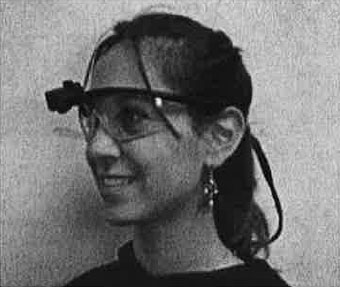 A
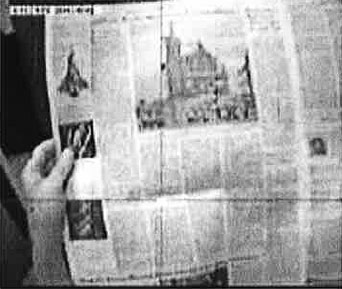 B

> Figure 3-1.
> > A) shows a model wearing a Mobile Eye unit from Applied Sciences Laboratories,
> > B) is an example of the exported digital video file of the scene camera with a cursor overlay. (Source: http://www.a-s-l.com/, Last accessed July 12, 2007).

The ASL Mobile Eye has a benefit of being designed for free-moving and sports applications. The entire head-mounted tracking unit worn by a participant weighs 76g. This model can tolerate moderate head movement without having to be recalibrated while still providing visual-angle accuracy of 0.5 degrees, a range of 50 degrees horizontally and a range of 40 degrees vertically (ASL, 2007). These axes ranges have an important implication. These wide ranges allow for the participant being tracked to read by shifting the eye vertically or horizontally instead of having to look directly ahead. Forcing the participants to stare straight ahead would require the reader to either tilt/rotate the head to realign position of gaze or to move the prototype stimulus in space. Both of these alternative navigation behaviors are completely unnatural to true life reading habits and would destroy measurement validity.

## Content Analysis

The content analysis strategy used was similar to the EyeTrack07 (Adam, Quinn &amp; Edmonds, 2007) study because data for the present analyses were obtained during the same participant sessions. The codebook focused on instances of eye-stopping events and the length of those events. The object of the content analysis was to look for reading patterns beginning at the first gaze event on a page and following eye movements throughout a reading session.

Other studies (Josephson &amp; Holmes, 2002) have used software to count fixations and generate graphical scanpaths. Fixation-counting software generally is based on a coordinate system. These systems make it difficult to account for a third dimension in addition to horizontal and vertical axes. For screen-based stimuli, this limitation can be overcome by assigning a different two-dimensional coordinate system to each page viewed. Unfortunately, there is no easy way to accomplish the same technique with print-based stimuli. Researchers wanting to use software for coding are restricted to a one-page stimulus. This restriction is unacceptable when the intention is to record eye fixations on a spatially stacked stimulus like a newspaper, where an x-y coordinate pair could indicate dozens of different news items depending on the page. A human must manually code when a subject turns a page and is exposed to a fresh portion of the stimulus. Also, automatic coding discards the types of content being gazed upon. This information can be reconstructed afterward by referring back to the stimulus and overlaying coordinate data, but this technique is counterproductive when the intent of a study is to analyze the types of news items looked at and not the positioning of those items.

### Codebook

The current study is based on prototypes. The print prototypes are restricted to a single page. The online prototypes, however, do include links to take the readers to full versions of stories as well as other content. Thus the print and online stimuli have different inherent characteristics and ways of letting the participants interact with the medium. This causes some concern about making direct cross-media comparisons.

The multi-page structure makes automatic coding more problematic because it cannot be assumed that all participants have been exposed to all available content. The coding team focused on the type of elements that participants looked at, such as headlines, photographs, cutlines, teasers, ads, navigation, etc. By coding the actual events gazed upon and not coordinate locations, this study hopes to find common sequencing of the types of elements looked at for pages within a publication. This is in contrast to auto-coding software looking for coordinate sequences. The implication is this manual coding strategy takes a lot of time -- approximately 30 minutes per participant -- but yields data indicative of what people look at instead of just where people look in an abstract geospatial context.

The codebook used in this study opts for maximum precision. The news prototypes used in the current study were restricted to one main story, supplementary content and some unrelated content such as briefs or advertisements. The use of prototypes makes it possible to assign a unique code number to every visual element (such as photo caption, headline, etc). The number of codes per stimulus ranged from 65 codes for the first print prototype to 150 codes for the third online prototype. This precision permits analyses of both content and also position of an item on the stimulus.

The current study is interested in the reading sequences of different typologies of visual structures. However, the precision of the coding allows for future micro comparisons of how a small group of specific items interrelate regarding reading patterns and cognition. The current study records the types of content gazed upon by participants, so being able to clearly distinguish between different elements is essential.

The codebook uses individual news items as the unit of content (Riffe, Lacy &amp; Fico, 2005) but does not place these items into categories. For this content analysis, a unit is defined as a single, unique visual element on a prototype. A unit can be a photograph, a headline, a caption, a map or many other structures. They must have a clear visual and content separation from other items. All text within a story will be counted as a single item because this content is part of the same thought or piece of information. A photograph and accompanying cutline will have two distinct codes. Although they are related in content, they are visually distinct and use different information structures. Essentially each unique code number serves as its own category. Assigning a distinct code to each possible visual element reduces subjectivity in code assignment between coders (Riffe, Lacy &amp; Fico, 2005). Intercoder agreement benefits because the coders must only associate a gaze location to a code number instead of using operational definitions to associate a gaze location with a structure type, which is then represented by a code number. The subjective task of deciding a structure type based on visual traits would lower intercoder agreement.

### Coding Process

An event begins when the eye is fixated on a point representing a visual element. That event ends with the gaze move outside the boundaries of the particular visual structure. The time between the beginning (onset) and ending (offset) of gaze at a single visual structure is recorded. Each event can be thought of as a block of consecutive fixations within the bounds of a single visual structure. To accurately code a fixation, a video player capable of a playback speed at a rate congruous with the 300ms fixation threshold was necessary. This threshold relates to findings from Lang (2000) regarding the time separating orienting responses from cognition. A code number, corresponding to a unique news items of a stimulus, is coded when any portion of that item is fixated upon. Eye movements, saccades and fixations that stay within the boundaries of the currently entered news item are counted as increasing the duration fixated upon the particular news item. Playback speed is slowed to 300ms to record the onset and offset times of gaze upon a single item to a tenths decimal-place precision. The slower playback speed also is used to distinguish saccades from fixations. Saccadic movement can be smooth or jagged. The 300ms fixation threshold is used to determine whether a subject's eye movement is coded as a true fixation or disregarded as an eye shift during saccadic movement that is below the threshold necessary to enter a new fixation code.

A software program called VLC (VideoLAN, 2008) is used for video playback. Codes can be entered in any text editor following the Sequential Data Interchange Standard developed by Bakeman and Quera (1992; 1995). For example, a subject fixates on a particular photograph within a stimulus. The researcher enters the corresponding item code and the fixation onset time into a text editor. Fixation onset times are relative to the start of the video. When a second item is fixated upon, a new item and onset time pair is typed into the text editor. A specialized processing program call GSEQ (Bakeman and Quera, 1992) processes all of these item/time pairs and calculates the resulting durations of visual attention given to items.

One additional coder was used to calculate intercoder reliability for the content-analysis method. The sample size needed to achieve a minimum reliability agreement was calculated using the formula from Riffe, Lacy &amp; Fico (2005, p. 145). The calculation yielded a reliability sample of 24 videos. The second coder was trained using two randomly sampled videos from the study population. The primary coder demonstrated the content analysis coding procedure for a portion of the first video and had the second coder complete this video file with the first coder available for clarification. The second video file was coded independently by the reliability coder and confirmed by the researcher for quality. The second coder was instructed to follow a 300ms fixation threshold and code based on printed versions of prototypes with stickers affixed indicating the proper code. Then, a reliability sample was selected from the study population using a random-number generator. Duplicate content units, or video files, were replaced at random to prevent any files from being recoded more than once.

## Data Reduction

The data-analysis process utilized several pieces of software to first code sequential data, recode or collapse unique codes into categorical typologies, calculate contingency-table statistics for Markov chains, and finally export contingency-table data into a form suitable for importing into general-purpose statistical packages. Transparency of the data reduction process is particularly important. Few if any mass communication studies have utilized a content analysis strategy with temporal or sequential information. The most important assumption of traditional content analysis is for contingency tables of count data that require independent observations. Independence is the criteria tested to determine if some content appears more often than other content. The current study takes a completely opposite approach. Understanding sequences of reading behavior is useless without accepting that where someone will look is very much dependent on where they have looked. This section will describe how statistical dependence can be beneficial for understanding complicated relationships and how dependence-based contingency tables can be applied to content analysis methodologies.

### Sequential Data Analysis

Gottman and Bakeman (1979) published behavioral-interaction research that allowed for the coding and analysis of sequential data. Their behavioral studies often involved the interaction of children during play (Bakeman &amp; Brownlee, 1980; Gottman, 1983) or marital interactions between spouses (Gottman, 1980; Gottman &amp; Levenson, 1992). The statistical methods used were refined and a standardized structure for recording sequential data was proposed. Bakeman and Quera (1992) referred to their format as the sequential data interchange standard or SDIS. The mathematical principles were not new, but the formulation of a common data structure and a specialized statistical software package for analysis has made this a viable research and analysis methodology for most social science fields. Bakeman and Gottman (1997) provide a well-articulated introduction to extending categorical data analysis to incorporate sequential data. Gottman and Roy (1990) provide thorough mathematical descriptions of using contingency-table statistics with sequential data and comparing multiple tables across time units.

### Categorical data analysis

The most important principle for sequential data analysis is the principle of expected frequencies at specified lag intervals. Metric data allow tests of association by calculating a correlation or covariance matrix. Categorical data (including nominal or ordered data) necessitate a different approach. So we can construct a contingency table that compares frequencies of a finite number of possible outcomes. Next a decision is made regarding the number of total outcomes, which are how many fixation events an individual will have during the session. Knowing the number of outcomes permits a focus on the marginal distributions of row and column totals. For the current study, the length of exposure is known, but the number of fixation events is not. So, our attention falls on the joint distributions, or counts within cells. The Pearson Chi-square or other tests such as Likelihood-ratio G2 provide testable criteria for cell counts statistically differing from what is expected under the null hypothesis of no association between the variables (Agresti, 1996).

Evidence of an association between variables permits joint distribution of cell counts for calculating conditional probabilities. Conditional probabilities estimate expected values of one variable conditioned on a specific level of another variable. In this study, contingency-table statistics will be crucial for testing most of the hypotheses comparing differences between prototypes as well as sequences. While the statistical principles of categorical data analysis should be familiar to the reader, further detail is needed to articulate the inclusion of time-based information.

### Time series analysis

The two central theories to the present study are Feature Integration Theory and Scanpath Theory. Feature Integration Theory (Treisman &amp; Gelade, 1980) relates the patterns of eye movements to cognitive activity. Scanpath Theory formalized eye-movement sequences as a type of statistically dependent stochastic process (Josephson &amp; Holmes, 2002). The previous section described the primary assumption of data necessary for traditional content analysis: independence. The present data are not independent observations, so a modeling approach must accommodate dependent observations. Time series analysis encompasses a broad range of statistical applications to better model fit by utilizing the sequential information contained within dependent observations.

The concept of a stochastic process is tightly coupled with statistical dependence of observations:

> A stochastic process is a family of time indexed random variables Z(ω, t), where ω belongs to a sample space and *t* belongs to an index set. For a fixed *t*, Z(ω, t) is a random variable. For a given ω, Z(ω, t), as a function of *t*, is called a sample function or realization. The population that consists of all possible realizations is called the ensemble in stochastic processes and time series analysis. (Wei, 2006, p.6)

Simply, the value measured on a response variable is just one of a population of possible responses by that individual on that variable. A standard Likert item is a self-reported measure by an individual ranging from "strongly disagree" to "strongly agree" with some number of intervals between (Babbie, 2004). Imagine that the individual could answer that questionnaire at many times, essentially an infinite number of time points. The true value of that response might be somewhere between "agree" and "strongly agree". But the individual could answer to either of those available choices depending on time of day, question ordering or physiological factors such as tiredness or dehydration. The individual may truly be between two available responses, and small variations yield one of many possible responses. Whether this minutia of variation has an influence on the fit of a statistical model is as much an epistemological debate as a mathematical one. Some analysis procedures do not allow for allocation of this random error to the function, but allocating error within an indicator variable can provide a more informative model of a complex system. For the current study, the scanning and searching techniques of readers are dependent on previous exposure and stochastic because scanpaths can have random variations.

The particular stochastic process utilized here is a Markov process, or more formally a first-order autoregressive process (Wei, 2006). Essentially, information from an observation can help predict the probability of a particular value for a subsequent observation. This process is invertible and stationary. The invertible characteristic allows for the sequence of elements to occur either A then B or B then A. The participant can look at a headline and then a photo just as easily as looking at the photo followed by headline. This is congruent with the Feature Integration Theory proposition that exposure to a visual stimulus creates a mental map of the stimulus that can be applied as a shortcut to a complete visual scan when the individual encounters a new visual stimulus. The mental stitching of the individual snapshots of the stimulus happens very quickly. Once the cognitive map is created, behavior during further exposure is used to consume or process the content instead of to scan and detect the types of content.

The stationary characteristic means that the probability of looking at A then B will be the same regardless to the duration of exposure. During initial exposure to the visual stimulus, the individual may look at many elements in rapid succession, but the sequencing of element types will be the same whether A then B occurs early or late during exposure. Scanpath Theory provides a theoretical framework and Sequential Data Analysis provides an analysis toolset to describe associations between different elements in a visual stimulus, such as a newspaper prototype, Web site or another medium combining text and graphical elements.

### Sequential Data Interchange Standard (SDIS)

The GSEQ software (Bakeman &amp; Quera, 2008) uses a Sequential Data Interchange Standard (Bakeman &amp; Quera, 1992) to code and calculate statistics for events that can happen sequentially, concurrently, and with or without duration for observations. Although many pages could be devoted to describing the myriad types of possible coding and analysis strategies for this data structure and software, further description will be limited to the strategy used in the current study. See Bakeman and Gottman (1997) for a conversational introduction. For a thorough statistical explanation, including the conceptual linkage between Markov chains and log-linear modeling, see Gottman and Roy (1990).

### Types of sequences

The first decision in choosing a type of sequential analysis is whether time or simply order are important to the research design. Research concerned with exposure has a central interest in preserving time-based information. For visual stimuli such as news prototypes, knowing the aggregate time individuals gaze at headlines, photos, text or advertisements could be of primary interest. Understanding the amount of time readers allocate to different types of content or visual structures can provide measurable guidelines for future design and content production. These considerations would necessitate the use of "state sequences" for coding. State sequences allow the examination of the total time spent looking at photos or the average duration an individual looks at a headline before moving the eyes toward another visual element. State data require an event code at the time that particular event begins relative to the beginning of the exposure session. If there are gaps of time that should be discarded, ending times for an event also can be coded. An example would be a content analysis of a television news program.

Perhaps we want to code the types and durations of video segments. Commercials should not be included, so including onset and offset times would create appropriate time gaps to only preserve program-based information. If all time within a session is treated as exposure, then only onset times are necessary. SDIS automatically generates offset times as occurring directly before another event onset begins. The current study had participants freely reading news prototypes, so all time within a session was treated as exposure.

Another research question could explore what order visual elements are fixated upon. If ordering is the only interest, we can omit recording the time information and simply code if an event occurs. These are "event sequences" in SDIS structure. Analyzing the probability one code will follow another requires the creation of contingency tables and conditional probabilities for a Markov process. This type of analysis utilizes counts of events and discards time information. There are other SDIS sequence types if the unit of interest is a time-specified interval or if multiple events can occur simultaneously. The Bakeman and Quera (1995) text provides research examples and appropriate sequential structures. The current study used "state" sequences to incorporate fixation sequencing and durations. "State" sequences were reduced via GSEQ to "event" sequences in order to compare scanpaths across prototypes.

### Notation for coding with SDIS

Coding for a sequential analysis can be accomplished in real-time but more likely incorporates video capture of behavior. Eye-tracking studies use multiple cameras and interpolation to generate a video file that shows the visual stimulus with a crosshair indicating central foveal vision. VLC Player (VideoLAN, 2008) allows speed-reduction control. Typically, a playback speed of 250ms was used to code onset times. This playback speed was the closest option to the 300ms time thresholds for cognition to begin (Lang, 2000).

Video playback begins with content of the necessary calibration procedure during the eye-tracking session. The first coded item will occur immediate upon exposure to the visual stimulus. The element code from the codebook is inserted along with the onset time in a format resembling "headline1,15:54.3" to indicate headline 1 was fixated upon at 15 minutes, 54 seconds and 3 tenths relative to the beginning of the video file. If necessary, an initial onset time can be recorded without a code. This technique would be useful if the length of time between the start of playback until the first event occurring was important. This was not the case for the current study because this time did not include exposure to the stimulus. The SDIS structure allows several time formats depending on the size of units of interest. Continue to enter these couples of code and onset time. At the end of the exposure, the coder enters something like ",20:52.7/" to indicate the offset time for the final event as well as the forward slash to indicate the termination of this coding session. If there are expected gaps between events of interest, it is suggested to record offset times for each event in addition to onset times. In the above case with only onset times, the SDIS software automatically computes the offset time to be the smallest time unit, such as a tenth of a second, prior to the onset time for the next event. Each unit representing a code session begins with some serial number for the unit, followed by code/onset couples and end with a terminating forward slash. Spaces are used to delimit event couples within a unit.

### SDIS format and recoding

SDIS data were recorded using a plain text editor and imported into the GSEQ software package (Bakeman &amp; Quera, 2008). Procedures were run to identify coding errors such as typos. The process of compiling plain-text SDIS files into the format suitable for GSEQ analysis included a syntax check. Typographic mistakes were corrected before final analyses. Shorter code names were used and keyed to a longer description in the output. Levels within a variable were specified instead of the ambiguous use of integers to reflect categorical data. This is analogous to variable names, labels and values in a package like SPSS. The GSEQ package generates plots of sequences for each unit/session. There is no procedure to generate the most likely sequence from an array of sequences. Doing so requires extremely large sample sizes and cannot be mathematically reconciled with categorical data. This study included prototypes containing 50 or more different visual items. Transitional probabilities of what type of structure will be fixated next based on the current fixation location cannot be computed with 50 different possible choices, yielding a 50x50 contingency table. Recoding syntax was used to collapse unique codes into typologies of headline, text, photo, caption and graphic.

### GSEQ statistics and export

The GSEQ package includes procedures for reliability, descriptive and inferential statistics. Compiled SDIS files from the author and the reliability coder were compared for agreement using Kappa. While there is no option within the software to use a different reliability statistic, Kappa is appropriate for nominal data and to correct for chance agreement. The GSEQ "Simple" command generated descriptive statistics for codes including frequency, duration and many ratio combinations such as average, minimum and maximum duration of fixation events.

The GSEQ "Stats" command calculated contingency-table statistics based on a specified lag. For time series analysis, a lag indicates the number of time points that come between the two points of interest. A Markov chain is a specific stochastic process with a lag of 1, or there are no unknown time points between the two points of interest (Wei, 2006). A lag 1 stochastic model was specified because Feature Integration Theory (Treisman &amp; Gelade, 1980) states the location of current visual interest affects the probability of which area the visual field will be fixated upon next.

GSEQ output included observed and expected joint frequencies, raw and adjusted residuals, and also transitional probabilities. Pearson Chi-square and Likelihood-ratio G2 provided tests for expected versus observed frequencies of event sequences. Transitional probabilities were used to look at two particular events and determine how often that sequence appears compared to expected values. For example, one cell provided the frequency a headline event was directly followed by a photo event. The transitional probability provides an indication of how often this sequence is expected compared to all possible second events. Z-scores indicated significant difference of observed from expected frequencies for the two-event sequence pair specified in the models. The current study had no structural zeros within the contingency tables.

A major limitation of the GSEQ software is the restriction of analyses to two-way contingency tables. In the case of a third variable with *k* levels, *k* two-way contingency tables are calculated with appropriate statistics for partial association for each *k* table. There are no statistical procedures to infer conditional independence and tests of homogenous association such as the Cochran-Mantel-Haenszel Test (Agresti, 1996). Fortunately, GSEQ exports data in a user-specified form. Further analyses were conducted in SPSS 16.

## Summary

Eye tracking has been used to better understand the theoretical and behavioral constructs of reading, scene perception and visual search. However, few studies have applied eye tracking to understand how people process news content. Also, content analysis methodologies used for mass communication research do not account for sequential data and the importance of previous exposure on understanding future exposure to visual structures and messages. As the number of media increase and types of media diversify, content analysis must change in order to more realistically model how people interact with and respond to visual structures whether presented through print newspapers, television, mobile devices, or through platforms and devices created in the future.

This study used the data of 155 people tracked during free reading of news prototypes in print and online. The content-analysis strategy leveraged the temporal and sequential nature of the experimental design in an effort to more realistically model how individuals process visual structures of news design across media. Hopefully the results of this study will help news designers leverage available visual and story-form structures to maximize information recognition and minimize the costs of production. Also, the content-analysis strategy should be extended to other mass communication research interested in exposure to content regardless of text, audio, video or combinations of information forms.

---

# Chapter 4
# Results

Some components of the experimental design were outside the control of the researcher. The Poynter Institute recruited participants, created the prototypes and conducted the eye-tracking sessions. Therefore attention will first be paid to matters of validity. A proper analysis of coder agreement is necessary to allow other researchers to replicate and expand the results. After assessing validity and reliability, results will be reported for each research hypothesis. Finally, the exploratory research questions will be investigated.

## Validity

### Participant demographics

The St. Petersburg Times recruited participants through advertisements in the print and online versions of the newspaper. The participants were recruited with no intention of drawing a probabilistic random sample from the geographic reach of the print newspaper but rather to be representative of frequent readers either of print or online versions of the St. Petersburg Times. See Appendix A for the selection questionnaire.

Participants were assigned to an experimental condition in a rotating order of prototype one, two, three, one, two, three, etc. This assignment strategy was used to ensure equal counts between the different conditions. Print prototypes were administered during one week, and online prototypes were administered another week. Since participants were not randomly assigned to treatments, there was a concern that the demographics could differ across treatments. Simply, statistical estimates of a single variable will not be consistent between treatments if there is no homogeneity across subject pools. There is no sampling design that can be applied to provide estimated sampling error. However, demographic comparisons across treatments can defend against an argument of differing subject pools.

Descriptive statistics were generated for participant demographics. Comparing across the experimental treatments of media and stimulus type, no practically significant differences were found regarding participant age and sex. Although mean values for categories do not make much sense in terms of describing the participants, the visual representation is adequate to detect a problem for participant recruitment:

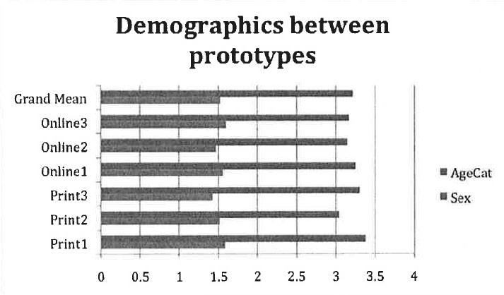

> Figure 4-1.
> > Participant demographics of the six prototypes are compared to an overall average including values from all prototypes. Values of 1.5 for "sex" and 3 for "age category" would indicate perfectly symmetrical assignment for each demographic category of interest. Similar values across prototypes indicate similar samples of participants were exposed to each prototype.

Participant ages were coded in five ordinal categories, and sex was coded as two nominal categories. Similar frequencies in each category yield a median value of 3 for the age category and a 50 percent split for females and males. The proportions hold steady across prototypes. Therefore, participants assigned to each of the six prototype versions appear to be of similar compositions of sex and age.

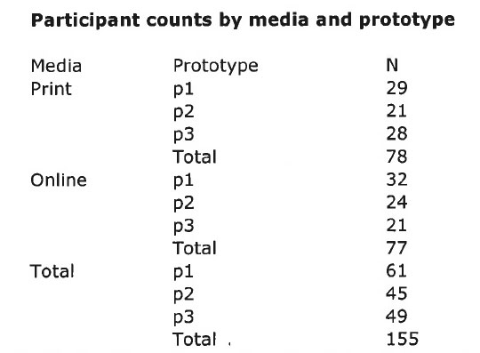

> Table 4.1.
> > Shows the number of participants for each prototype version and media.

This is a defense that the various experimental treatments were administered to demographically equivalent participants. However, it must be noted that the lack of a probabilistic sampling design makes external generalizations beyond this study tenuous at best and not statistically defensible.

### Stimulus manipulation check

Another threat to validity is the nature of the prototypes. Professional newspaper designers and staff at The Poynter Institute designed the prototypes to include the same information in visually different structures. The prototypes are visually different and these visual differences will affect reading behavior. Therefore, a manipulation check is necessary to validate this argument that the prototypes truly are perceived as different.

Students in an undergraduate communications course were used for the manipulation check. An overhead projector was used to show the students each prototype for approximately 10 seconds. Students were asked how strongly they agreed that they could detect visual differences between the prototypes. Responses were recorded on a nine-point Likert item ranging from strongly disagree to strongly agree. The mean score of 7.52 (N = 23, s.d. = 1.19) corresponds to a strong ability to detect visual differences. The confidence interval estimates the low value to be 5.13 (α = .95) and still indicating a perceived ability to detect visual differences between the prototypes. Perceived differences in the visual field provide a simple check that vision and cognition processes would differ between the prototypes.

### Participant awareness

A potential weakness of experimental studies is it can be difficult to generalize to situations beyond the design. In this study, participants could not read the newspaper or read news online in their natural setting. Instead, the environment is controlled to maximize internal validity that measured differences are a result of the stimulus conditions and not confounded by variables and individual differences. During the exit interview, participants responded as to the level of intrusion of the eye-tracking hardware and if the experimental conditions had affected their normal reading behavior. Only 2% of participants responded that the apparatus distracted them or caused them to read differently than usual. Readers assigned to different prototypes showed no difference in responding to the level of apparatus intrusion (χ2 = 17.02, df = 15, p-value = .318; G2 = 17.99, df = 15, p-value = .263).

## Reliability

The option of using software to automatically code based on eye-fixation coordinates was previously discussed as inappropriate when the content at any x,y coordinate pair can change over time or through the behavior of the participant. Instead, the coding protocol used for this study relied on human coding of types of content. The GSEQ software computes a Kappa measure of intercoder agreement for sequential observations. Overall Kappa was 0.89 indicating a very high level of agreement between coders.

## Recoding unique elements into typologies

Although every visually distinct element was assigned a unique code for the content analysis, recoding into typologies was necessary for most of the analyses necessary to answer the hypotheses and research questions. Without recoding, the smallest possible contingency table would be larger than 60 by 60. This would be the approximate size for the first print prototype. A table of this size would require close to 20,000 observations if all observations were evenly distributed among cells. Instead, unique codes were recoded into typologies such as headlines, photographs, article text and alternative story forms (such as maps). Some findings might raise a question regarding the relationships between a few unique visual elements. These relationships can later be explored if necessary.

## Hypotheses

GSEQ was used to calculate descriptive statistics such as code frequencies and durations. The GSEQ software also was used to generate sequential statistics. Next, each individual sequence was partitioned into 30-second intervals. The number of fixated elements was counted within each of the resulting 10 intervals.

> **H1: Visual elements, or structural types of news content, on a stimulus will not have equal probabilities of being fixated upon by a reader.**

The content analysis is based on location of eye gaze, so there can only be one location of gaze for a particular time point. The simple probability for a visual element to be fixated upon is a ratio of how many fixations were on a specific visual element out of all fixations. Bakeman and Gottman (1997) refer to this as a "simple probability" because it is independent of time or previous fixations. GSEQ counted all fixations in tenth-of-a-second intervals and aggregated fixations for each type of visual element.

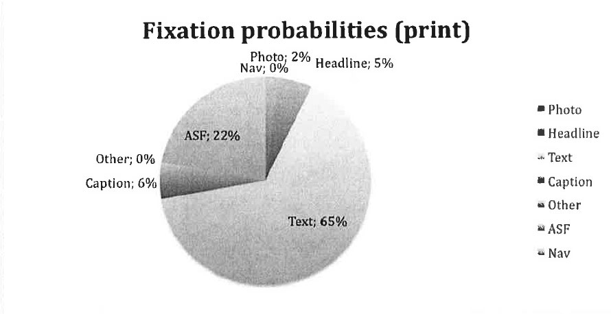
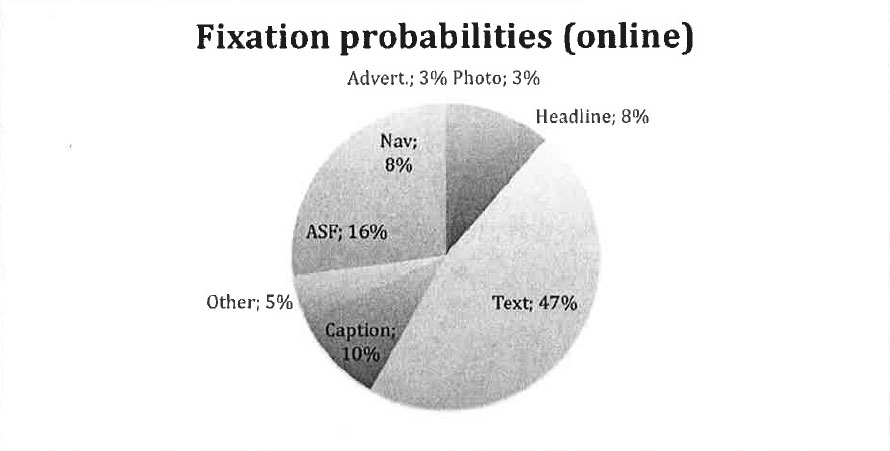

> Figure 4.2.
> > Aggregated fixations for (a) print and (b) online both indicate that visual elements do not have equal probabilities of being fixated upon regardless of the medium.

Although GSEQ aggregates events and times for eye movements, there are no reports of variance between individuals. A formal ANOVA procedure to simultaneously compare all of the different types visual elements would be preferred. However, some prototype versions did not have alternative story forms (ASFs) or advertisements. Because the types and number of visual elements changes between prototypes versions, we cannot assume common variances for each code type. Therefore a crosstabs procedure was run in SPSS. A Pearson chi-square test (χ2 = 3593 , df = 35 , p < 0.001) found observed cell counts were not equivalent to expected values under the null hypothesis that fixation frequencies are independent of the type of visual element. A likelihood-ratio chi-square yielded the same result (G2 = 4041 , df = 35 , p < 0.001). These two tests provide strong evidence to reject the null hypothesis of fixation probabilities independent of the type of visual element. H1 is confirmed; different visual elements do not have equal probabilities of being fixated upon.

> **H2: Readers given prototype news pages that utilize smaller, discrete storytelling elements will perform better information recognition.**

The first prototype for both print and online was designed to be mostly of a traditional style utilizing primarily text. The second prototype combined traditional narrative text as well as some alternative story forms such as fact boxes and maps. The third prototype for each medium contained no traditional narrative text. Alternative story forms are used in a context-dependent manner, meaning that the form is chosen to most efficiently display a specific type of information. A simple example is that geographically based information would be displayed in a map story form instead of using traditional narrative text to describe the geographic information.

For this study, the hypothesis anticipates that using story structures that are most visually indicative of content type will allow the participant to more efficiently process different types of information based on previous experiences with visual stimuli. It seems obvious that a visual element of a map should contain information related to geography. Instead of having to parse information from text and simultaneously process many types of information, visual elements with a narrow category of information will be more efficient to cognitively process. This cognitive efficiency should yield better information recognition.

After participants finished the eye-tracking session, a facilitator administered an exit interview complete with a nine-item quiz of information contained within each prototype. Each question had three multiple-choice answers. Also, each prototype contained the specific information necessary to answer each question. Because the questions had the correct answer available among the multiple choices, this cognitive task is measuring information recognition alone and not information recall, which would require open-ended questions.

A two-way ANOVA was run to compare the average quiz scores between different prototype versions and between media. The model was first run to include age and sex. Both were insignificant predictors and dropped from the model.

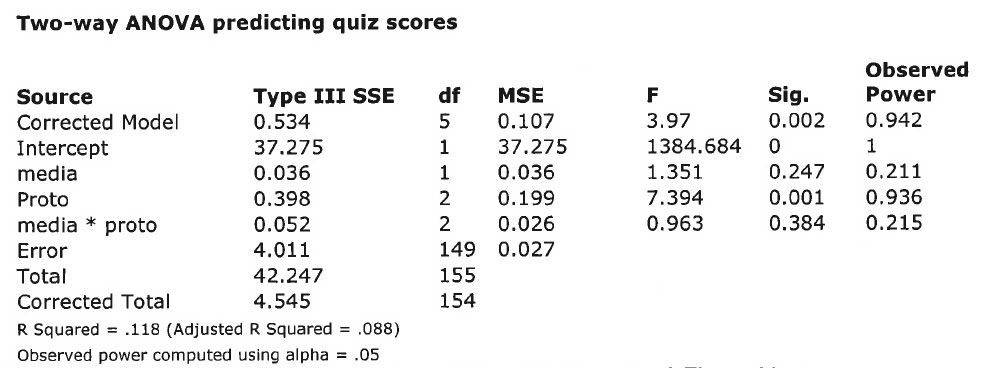

> Table 4.3.
> > The results of the SPSS univariate General Linear Model procedure. The resulting two-way ANOVA shows a significant main effect of prototype and no main effect of media.

The final model had significant main effect for prototype (F = 7.39 , df = 2, p = 0.001) and no main effect of media. The two-way interaction also was not significant. The more complex model with sex and age had an Adjusted R Squared of 0.089, so the reduced model provides equivalent explanation of error (Adjusted R Squared = 0.088) with two fewer predictors.

Individuals exposed to the prototypes containing alternative story forms had significantly better quiz scores than those exposed to the first prototype containing all traditional text. Overall, the third prototype had the highest quiz average (u = 0.552 , s.e. = 0.025) followed by the second prototype (u = 0.506 , s.e. = 0.025). These two prototypes yielded significantly higher scores than the first prototype (u = 0.432 , s.e. = 0.021). H2 is confirmed that prototypes utilizing smaller, discrete visual elements resulted in better information recognition. The lack of significant difference between the second and third prototypes is not unexpected. Both utilized maps and other non-narrative story forms to convey specific types of information. Including some ASFs was hypothesized to increase information recognition. In this respect, the two prototypes with ASFs should be significantly different from the all-narrative text prototype but not necessarily much different between the two with ASFs. Implications will be discussed in the next chapter. Also, the total explanation of error is less than stellar (R Squared = 0.118 , Adjusted R Squared = 0.088). Some explanatory analysis will see if other demographic factors and individual media usage can help explain more error.

> **H3: (a) The frequency of elements fixated by a person will be greatest during initial exposure, and (b) the frequency of fixated elements will decrease as exposure time increases.**

The frequencies of fixated elements were defined as the repeated measures in SPSS as a General Linear Model. The media (print, online), prototype version (1. traditional narrative text using inverted pyramid structure, 2. traditional text plus some alternative story forms, 3. no traditional narrative text) and sex (male, female) were added as between-subject factors. Participant age was incorporated as a covariate. After building the initial model, sex did not have a significant main effect (F = .617 , df = 1 , p = .433) and was not part of a significant interaction. Nothing in the literature suggested sex is a significant factor in news reading, but it seemed prudent to check. However, sex was not a significant predictor for fixation patterns and was dropped from the model. Age approached significance as a covariate (F = 2.646 , df = 1 , p = 0.106), so it was kept in the model. The final model contained media (F = 100.697 , df = 1 , p = <.001 ) and prototype (F = 7.361 , df = 2 , p = 0.001) as between-subject factors, age (F = 2.474 , df = 1 , p = .118) as a covariate and repeated measures for fixation frequencies at 30-second intervals for a total of 10 repeated measures of the one dependent variable. Fixation frequencies approximated normal distribution during the first interval then approximated Poisson distribution during the subsequent intervals.

Multivariate tests found significance for the repeated measure (Wilks' Lambda = .614 , df = 9.79 , p < 0.001) of fixation frequencies. There were no significant two-way interactions. Mauchly's Test of Sphericity was significant (Mauchly's W = 0.409 , χ2 = 129.49 , df = 44 , p < 0.001), so Greenhouse-Geisser corrections were used to re-estimate effect sizes. The repeated measures for fixation frequencies remained significant (F = 14.01 , df = 7.55 , p < 0.001), and there were no significant two-way interactions. There is strong evidence to reject the null hypothesis that fixation frequencies are the same for each time interval throughout the exposure.

Next, pairwise comparisons were used to compare fixation frequencies between specific intervals instead of just looking over all intervals:

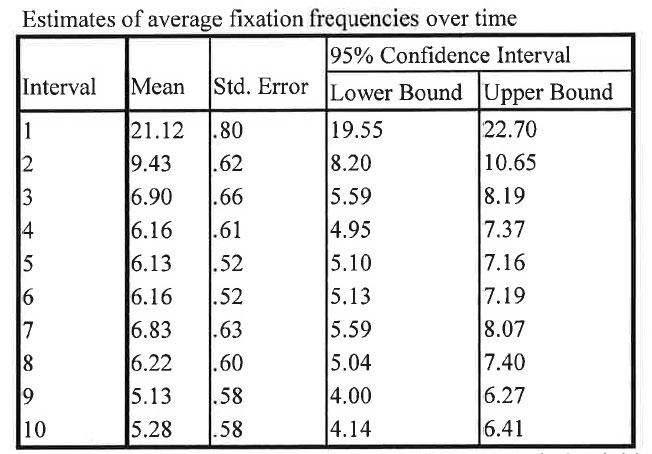

> Table 4.4.
> > Average fixations frequencies are greatest during initial exposure and decrease over time. Changes are significantly large for the first three 30-second intervals and level off for the remainder of the exposure.

The first and second intervals had a significant difference in means (|Δu| = 11.70 , s.e. = 0.97 , p < 0.001) as did the second and third intervals (|Δu| = 2.54 , s.e. = 0.81 , p = .002). After the third interval, the fixation frequencies level off and remain similar throughout the rest of the exposure. The first interval had the most average fixations (21.12), thus confirming H3a that fixation frequency will be highest during initial exposure. The second interval had an average of 9.43 fixations. Frequencies leveled off after the third interval. H3b is supported that fixation frequencies will decrease as the exposure time increases, though this does not follow a strictly linear trend. Later increases in fixation frequencies could be an indicator of boredom or disinterest. These implications will be explored in the next chapter.

> **H4: The variability of scanpaths between participants will increase as the visual complexity increases.**

Within the context of the current study, scanpaths are defined as sequences where the eye stops to fixate and then moves to another visual element (Brandt & Stark, 1997; Goldberg & Kotval, 1999). A generic sequence can be of arbitrary length, but Scanpath Theory (Josephson & Holmes, 2002) describes a first-order Markov process. This means the theoretical framework describes relationship between a visual element of fixation and the subsequent element of fixation. The GSEQ software computes the conditional probability of a visual element being the next object of fixation, conditioned on the existing eye location. The probabilities for scanpath sequences are provided in the next two tables. Probabilities have only been included for sequences that start with either a text or alternative story form (ASF) element. These two types of elements account for 87 percent of fixations for print participants and 63 percent of fixation for online participants.

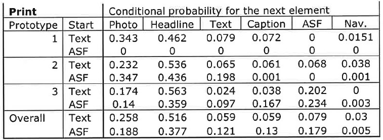

> Table 4.5.
> > Probability for what type of visual element will be fixated upon next given the participant is currently looking at a text or ASF element. Reported for print prototypes separately and merged together.

Scanpath sequences are invertible, so tables 4.5 and 4.6 can be interpreted either from rows to columns or columns to rows. The values in this study are not perfectly invertible so values may differ slightly. However, the omitted conditional probabilities are so small as to not be descriptively useful.

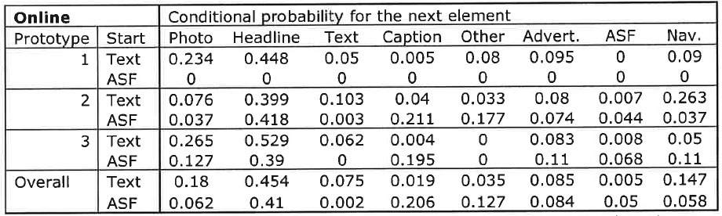

> Table 4.6.
> > Probability for what type of visual element will be fixated upon next given the participant is currently looking at a text or ASF element. Reported for online prototypes separately and merged together.

A row containing all conditional probabilities equal to zero indicates that element did not exist for that particular prototype version. When the participant fixates upon a text element, the most probable next fixated element was a headline (probability = 0.52 for print and 0.45 for online). Starting at text, the second-most probable next element was a photo (probability = 0.26 for print and 0.19 for online). Interestingly, navigation elements were almost as likely to be the second-most probable next element for online prototypes (probability = 0.15). When the participant is fixated upon an ASF, the most probable next fixated element also was a headline (probability = 0.38 for print and 0.41 for online). Starting at an ASF, the second-most probable next element becomes more varied. Online participants most likely next looked at a caption, other or advertisements. Print participants had similar probabilities of next looking at photos, text, captions or ASFs.

Initially, it seems readers currently looking at text seem most likely to next look at headlines and photos. Participants looking at ASFs might go to any type of visual element. The clearest way to test the variability of scanpaths would be to merge prototype versions across media and compare versions one, two and three. However, inherent characteristics of the two media create an obvious confound for cross-media comparisons. Visually complex print prototypes, as defined in this study, still are constrained to a single-sided piece of broadsheet newsprint. Online prototypes can have more pages with fewer types of elements on a single page. This partitioning makes it difficult to provide an overall test of scanpaths because the choices available to the individual are not the same for all prototypes. Even within one medium, the different available elements created contingency tables of differing structure at each of k-levels of prototype within a medium. H4 cannot be statistically tested because of design confounds, but there appears to be initial support that the use of alternative story forms relate to more varied scanpaths. The discussion chapter will suggest how future research can eliminate these confounds.

## Research questions

There is a lot of information attached to the participants in this study such as demographics (age, education, sex), fixation frequencies, information recognition scores, and self-reported media usage information for radio, television, newspapers and Internet sources. Comparing across different education and media usage levels was kept out of the model building for hypothesis testing. No literature provided a coherent theoretical connection between these factors and scanpaths, but exploratory analyses could hint at interesting relationship to be incorporated in future research.

SPSS generalized linear models were run to explore these relationships. All models assumed the form of Poisson log linear. Model terms were limited to main effects and two-way interactions because of no significant higher-order interactions. The defined dependent measure was set as the count of fixations occurring during the first 30 seconds of exposure to the prototype. The initial exposure is when vision and cognition work to detect, parse and prioritize information available within the visual field. Factors were set as media, prototype, sex, and level of education. Age was used as a covariate. Prototype was an insignificant predictor and dropped from the model. Predictors were tested using likelihood ratio Chi-square instead of Pearson Chi-square in order to penalize fit for arbitrarily including more predictors and interactions. Overall model fit is estimated by a ratio of deviance to degrees of freedom (G2 = 524.15 , df = 135 , ratio = 3.88). The smaller the ratio, the better the fit. This is an inadequate fit for theoretically derived models, based on Agresti's (1996) criteria that the ratio should be approximately 1 to indicate adequate fit. But this is not a surprise since this is an exploratory analysis. A saturated model was run including all possible multi-way interactions for fit comparison. The saturated model yielded a deviance fit ratio of 3.1, also above our rule-of-thumb threshold. The model with two-way interactions gives a more parsimonious model with similar fit (ratio = 3.88) to the saturated model.

> **RQ1: Will medium or story structure be more important in determining how people read the news?**

Prototype version was an insignificant predictor for the number of fixations in the first 30 seconds of prototype exposure. However media explained a significant amount of variance for fixation count during the first 30 seconds of stimulus exposure (G2 = 25.06 , df = 1 , p < 0.001). Participants exposed to online prototypes, regardless of version, fixated on more visual elements during the first 30 seconds than those exposed to print prototypes (B = 0.241 , s.e. = 0.152 , p = 0.113) though this difference did not achieve statistical significance of p < .05. This finding seems to fit Feature Integration Theory saying people create cognitive maps of visual stimuli to apply in future situations. This will be discussed in the next chapter.

> **RQ2a: How does sex relate with reading patterns?**

Overall, sex explained a significant amount of variance for fixation count (G2 = 26.26, df = 1 , p < 0.001). Men fixated on a significantly higher number of visual elements than women (B = 0.463 , s.e. = 0.143 , p = 0.001). In fact, this was the strongest predictor in the model.

> **RQ2b: How does education relate with reading patterns?**

Overall, participant education explained a significant amount of variance for fixation count (G2 = 28.2 , df = 6 , p < 0.001). Interestingly, one category generated significantly higher fixations counts when compared to the other categories: participants with a graduate degree (B = 0.685 , s.e. = 0.317 , p = 0.03). The overall trend was not linear, but the finding that those with the most education had the highest number of fixations is congruent with Feature Integration Theory.

> **RQ2c: How does self-reported media usage relate with reading patterns?**

Another generalized linear model was run with only self-reported media usage as independent variables and keeping number of fixations during the first 30 seconds as the sole dependent variable (G2 = 576.99 , df = 130 , ratio = 4.44). Reliance on different media used a four-point ordinal measure ranging from 4=always to 1=never. The model was adjusted using backward elimination until all predictors were statistically significant (α = 0.95). The first run had eight news sources (radio, morning television, primetime television, local television, national television, daily newspaper, Internet, news magazines). The second run dropped radio and primetime television. The third and final run dropped daily newspapers (G2 = 587.69 , df = 139 , ratio = 4.23). Although these indicators of self-reported media usage or reliance explained a significant amount of variance to remain in the model, comparing between levels does not provide much information. Individuals that reported they never rely on local television news had the most fixations, and those that reported they always relied on local television news had the fewest number of fixations. One possible explanation is that older participants have fewer fixations and rely more on local television news. An ordinal logistic regression model using age to predict local television reliance seems to confirm this (G2 = 6.82 , df = 8 , ratio = 0.85) with participants in the oldest age category relying the most on local television news.

---

# Chapter 5
# Discussion

The results and models of the current study can be a basis for understanding and predicting how people will see, behave and think as newspapers change from print to digital. Mass media is fracturing into customized information streams where users take a prominent role in selecting and filtering news. Evolving news platforms such as web, mobile, gaming, augmented reality and others to come necessitate researchers rethink how information is gathered, structured and designed for audience transmission and customization. Individuals utilize previous experiences with visual structures in order to efficiently prioritize news reading. They rely on visual cues and heuristics to lessen the cognitive effort of determining what information is available and instead allocate cognitive resources to processing and storing information. Readers first take inventory of what information is available and then systematically consume information. The amount and types of available visual structures drive eye-movement sequences as people read. Because previous experiences influence future behavior, news researchers will have to expand their analytical toolsets in order to understand the implications of shifting control from news creators to news consumers. This study is a step toward a scientific rethinking of how people use news.

## Findings

Scanpath Theory (Noton & Stark, 1971) posits that people take small snapshots of a visual stimulus during eye fixations. Saccadic movement between fixations brings a new area of a visual stimulus into primarily visual attention for cognition. The Feature Integration Theory (Treisman & Gelade, 1980) says that the small snapshots of a visual stimulus are woven together in the mind and stored as cognitive maps regarding the structure of the visual stimulus. These cognitive maps are used as heuristic devices when a person encounters a new visual stimulus.

If prior experiences with visual stimuli are important in determining how a person scans and processes through vision, then an individual should not look or search in random patterns. Peripheral vision, though physiologically incapable of allowing cognition, does serve the function of detecting visual elements. This detection process, accompanied by the mental retrieval of spatial maps from previous visual exposure, should allow a more systematic approach to looking and reading. H1 confirms this notion that objects can be detected by peripheral vision and then essentially ignored or at least moved to a lower priority for visual scanning and cognition. If this were not true, then essentially every visual element would have an equal probability of being fixated upon. For example, if a person is reading words within a news article, the lack of a detection mechanism and prior experiences would suggest that the individual is just as likely to look away as to continue reading. This seems a silly notion. Obviously the person knows that one word is generally followed by other words, and these groupings of words form logical structures such as sentences. On a more macro level, individuals can use prior experiences of reading a newspaper to know that a headline should provide the most important concept of a story, and that a story should follow below the headline. Photographs should be accompanied by some piece of text that describes the content of the photo and provides information regarding the source of the photo. Therefore, the individual can peripherally detect this text and know it is a caption. The person may be uninterested or not ready to centrally process the information contained within that caption. So then a modified spatial map would be created and stored, incorporating previous newspaper experiences but being more specific to the newspaper in hand. The individual may later decide that the caption is important and should be read. No detection process is necessary. The mental representation of the visual field is retrieved, parsed and the area of interest is located. The eyes can directly move to this point. The practical implication of these processes is that news designs should favor visual structures that allow readers to quickly detect the type of information being conveyed through those structures. For example, geographic information should be conveyed through the visual structure of a map instead of plain text, which requires the reader to cognitively transform this information before storing to memory within a geospatial schema. H2 confirms the hypothesis that news designs that incorporate distinct visual elements for different types of information yield greater subsequent information recognition.

The longer an individual is exposed to a visual stimulus, the more that person will rely on the cognitive map to select areas of interest instead of relying on a searching routine of fixations and saccades. H3 provides compelling information to confirm this. Participants looked, on average, at approximately 20 different visual elements within the first 30 seconds of exposure to a news prototype. This means readers first detect what information is available, prioritize this information and then systematically consume this information.

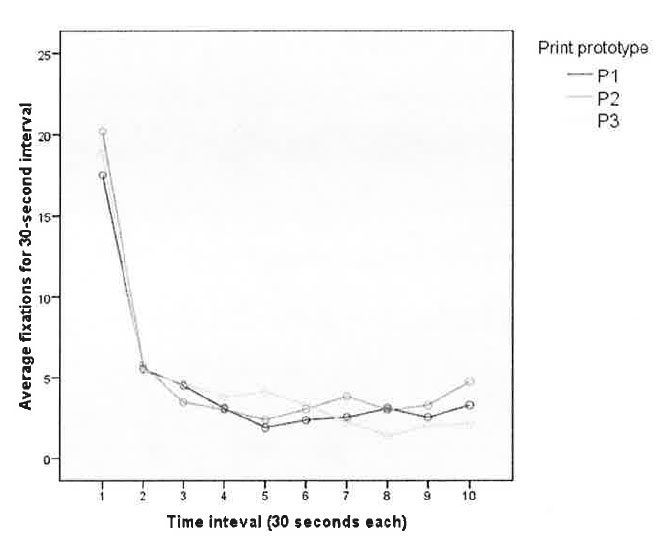

> Figure 6.1.
> > The average number of fixations is greatest during the first 30 seconds of exposure to one of three print prototypes. Fixation frequency falls sharply and then holds steady throughout the rest of exposure.

After the initial 30 seconds, the number of fixations was relatively stable for print but quite varied for online, Web-based prototypes.

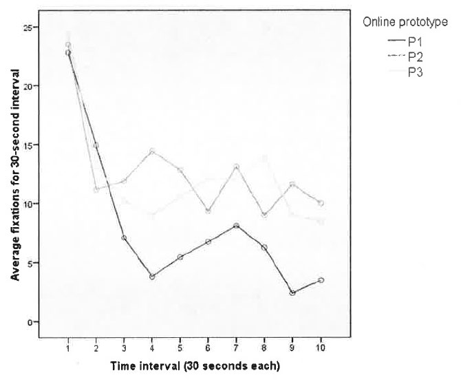

> Figure 6.2.
> > Fixation frequencies for online prototypes fall sharply after the first 30-second interval in a similar way to print prototypes. However, the frequency patterns are much more erratic for the remaining exposure.

These differences in fixation-frequency patterns between print and online prototypes fit nicely inside the theoretical framework because the online prototypes contain changing visual fields whereas the print prototypes contain fixed visual fields. By definition, the print prototypes were constrained to a single side of broadsheet newsprint. The online prototypes, however, incorporate the hyperlinking mechanism that is the hallmark of the web. Although the online prototypes contain the same information and similar visual structures as the print versions, the nature of the platform is very different. The print prototypes each contain a single visual field. The online versions purposefully separate information into different regions, often hid from view until the user clicks the mouse on a portion of the stimulus. This selective disclosure effectively creates multiple visual fields. Although the computer screen is fixed, the contents of the stimulus change based on user input. Hence, more detection and searching are necessary each time the prototype dynamically changes in order to create more accurate cognitive maps of the prototypes.

An industry implication is to limit the differences from page to page if the objective is for readers to process and store information. Information specifically requested by user behaviors, such as clicking a hyperlink, should be retrieved and displayed using appropriate visual structures based on information types. Other portions of the page should remain consistent during this content request, retrieval and refresh process. There is theoretical justification for asychonous loading of content in digital displays. Limiting unrequested changes is important because changes to the visual field would increase the cognitive resources toward detection and decrease cognitive resources toward processing and storage. Changes in the visual field should be confined to the information of primary interest to the reader, as indicated through clicking or other human-computer interactions.

So far, the data suggest participants use initial exposure of the stimulus to search the visual field and reconcile similarities and differences based on prior experience with similar stimuli. This is further supported by H4, which posits that scanpath variability will increase as the number of distinct visual elements increases. When reading text, participants were most likely to look at headlines or photos. This makes sense based of news-design traditions. Headlines are used to convey the overall point of an article. The text provides detailed information. Participants typically looked at headlines during the searching routine. After processing what main concepts were available in the prototype, the rest of the exposure was spent looking at text and supplemental content, such as photos and captions. However, the prototypes that utilized alternative story forms, or ASFs, provided the individuals with more options to see and process information. With a traditional text article, prior experience implies that reading should start at the beginning of the first paragraph and proceed in a linear fashion throughout the text. ASF structures break traditional text into smaller pieces. These pieces should allow for more efficient cognition when the partitioning is purposeful based on content types instead of just arbitrarily by word length or another size-based judgment. Geographically based information should be conveyed through a map illustration. Facts and figures can be more efficiently processed if they are separated from the main article and placed in visual structures that accentuate the numbers, dates or other specific types of information.

In this study, the print and online prototypes that utilized many ASFs in lieu of any traditional text yielded the best information recognition scores during the exit interview. Feature Integration Theory (Treisman & Gelade, 1980) states that previous experience with visual structures allows for quicker searching of the visual field. It seems logical that the same underlying mechanisms would allow more efficient cognition of that visual field. When reading plain text, the mind must process all text in a linear fashion and parse different types of information, such as geography, time sequences, etc. FIT does not specifically refer to cognitive overload in processing, but it seems logical that there should be less cognitive load when an individual is processing related information by type of content instead of having to create these separations and associations mentally on the fly. Perhaps the same neurological mechanisms that retrieve prior mental maps also utilize heuristics for available information to allow efficient processing of that information.

Visual cues serve as triggers whereby the mind retrieves an appropriate schema used to store and conceptually link similar information based on the type of information. For example, peripheral vision could detect that a map exists on the page. This detection is based on prior exposure to maps and what visual attributes indicate that the element is in fact a map. Prior exposure also includes a learned understanding that maps contain information related to geography such as points, distances and paths. As the eyes realign through saccadic movement, the brain could begin preprocessing geographical information. Fixations patterns on the map would allow more efficient storage of the information and generate related mental associations within memory. Improved efficiency at processing and storing information would allow for more accurate recognition and recall of information in the future. This concept seems logically valid but certainly needs more research before allowing for a quantification of what types of visual structures are most efficient for information cognition and retrieval. But at least at this preliminary stage, it seems useful to conclude that utilizing different visual structures for specific types of information allows for more efficient cognition than utilizing arbitrary visual structures or incorporating all types of information into a single structure of linear text.

The research questions were designed to compare demographic variables across media to determine whether these were significant factors influencing news-reading behaviors. First, it appears that visual structure is a more useful predictor of fixation counts than the medium of print or online. This seems logical but is misleading. Based on the theoretical framework, and supported by this study, there is no reason that reading on a screen should be inherently different than reading on a piece of paper if both use identical visual structures. Text and photos are detected and processed the same if both are presented on a flat, two-dimensional surface with the same set of allowed and expected behaviors by the user. This parity disappears when the behaviors used to seek information change. Print newspapers require two hands to hold, tilt, open and fold the newsprint. Online news sites require scrolling, clicking and other input. The obvious interactions of behavior and cognition require a lot of detailed research before we can predict how combinations of different visual elements, along with some set of allowed user behaviors, will succeed in having individuals use news sources, retain information, enjoy the experience and come back for more.

Gender seems to play a significant role in eye-movement behaviors, with men looking at more visual elements than women during the initial 30-second exposure to the prototypes. Education and self-reported media usage appear to be somewhat useful in predicting fixation frequencies. More education correlates to more fixations during the initial exposure. Perhaps the education variable could be a manifestation of prior experience with different types of visual stimuli. Perhaps increasing education correlates with increasing exposure to a variety of visual fields with varied information structures. Highly educated people may have more life experience detecting visual elements. Hence, this prior experience would allow quick scanning and detection of visual elements without having to allocate time to process the elements with central foveal vision in order to understand what types of information are available in the visual field.

## Summary of practical applications

The current study has some limitations regarding generalizability to all news design, but there are some practical applications news designers and editors can take away.

### Readers detect what is available and then choose

Entry pages, such as the front page of print or home page of a news web site, should include many story options. Readers should be able to scan a single visual field and achieve a sense of what information is contained within the publication.

### Use consistent visual cues and layout

Only change the visual field as requested by the user through some action such as clicking a headline to read a story. A portion of the visual field must change to render the information request by the user, but general layout and auxiliary visual structures should remain constant. Unnecessary changes increase cognitive resources toward detecting and away from learning. Unrequested changes should be used sparingly and specifically to draw reader attention to a specific element within the visual field.

### Use appropriate story forms

Use maps for geographically based data. Group similar types of data and use visual structures that accentuate these groupings and the nature of the data.

### Leverage reader experiences

Designers should base decisions on the experiences and expectations of readers. Visual structures should have cues that make detection of information types simple. A map should look like a map. A button should look like a button. Help the reader know what type of information is contained within a visual element, and avoid design choices that make detection confusing.

## Suggestions for future research

There are three main limitations to discuss in hopes of improving quantification of news design by future research. First, how can we improve the experimental designs to better apply findings to natural news reading situations? Second, how can we compare across media and devices that have very different inherent types of allowed behaviors? Finally, how can we better sample and model reading behavior and cognition regardless of the device or type of information?

### Experimental design

Developing a comprehensive framework to measure and analyze news-consumer behaviors and cognition will require a variety of experimental designs. The current study used limited prototypes and restricted users from accessing media outside the scope of these prototypes. However many variables changed simultaneously, so the first phase of future research should scale back the prototypes and instead utilize stimuli starting with single elements. We need to have a better theoretical understanding of how people process individual elements before constructing stimuli that have high-order interactions and allow for more realistic reading patterns. Manipulated variables should include content types, relevance to the participant and dimensional aspects including size and time. Signal quality of audio, image and video elements cannot be ignored. And this means we need to explore how people retrieve information in their daily lives. Different devices need to be used including desktop computers, laptops, mobile devices and even console video game systems that allow for information retrieval and news reading. Experimental designs need explore how device characteristics dictate how readers interact with available information.

### Inherent characteristics

The current study dictated participants would be exposed to information through two media platforms -- broadsheet newsprint and a website browser application on a desktop computer. These two implementations may be broadly applicable, but a robust theory of information design in a news context must anticipate the user, task and environment. Different people have different expectations and patterns of information seeking. These different tasks are accomplished through actions that change with the environment. An individual may have a pattern of behavior used when retrieving information at home on a desktop computer that is different than on a mobile phone. Not only is the physical location different but also the device used to retrieve information is different. The user-centric media environment is dictated by the allowable input and feedback behaviors of the device. We cannot overlook how, where and when people retrieve news. News-design researchers should explore how human-computer interactions for different devices affect how people retrieve and process news.

This study did not focus on the types of allowable behaviors between print and web-based prototypes such as folding paper or clicking on hyperlinks. But there is no doubt that the nature of hypertext on the web allows the user to be exposed to information in sequences impossible through a paper-based platform. The use of hypertext allows nonlinear progression through content, and this inherently allowed behavior has implications for both the content creators and consumers. McAdams and Berger (2001) suggest that allowed behaviors of a medium or platform should be taken into account during content creation. Another option is to take content created for a specific medium, like a broadsheet newspaper, and repurpose the content for other media. This "chunking" process has been conceptualized both as occurring as a result of the type of information (Nielsen, 2000) as well as an after-the-fact partitioning of content for a different media. However, the types of information and inherent behaviors of the media should determine story structures instead of arbitrary repurposing. In other words, use a round peg for a round hole instead of cramming a square peg. Designers should consider the expectations of users and characteristics of devices when deciding which story forms most efficiently convey specific types of information.

Encountering new types of story forms and visual structures could lead to disorientation as to the proper way to follow or comprehend the information within a story. An individual looking at a text news story has an implicit understanding of the way in which the story should be read -- from top to bottom in a linear manner. Engebretsen (2001) refers to this as coherence, or the ability to understand how text and visual elements are connected through implicit and explicit cues. Because hypertext allows for nearly limitless paths through a text, or the combination of elements that comprises a story, McAdams and Berger (2000) argue that the writer or content producer should construct a hierarchy for a story to reduce confusion within the individual regarding where to go next. Engebretsen (2001) conceptually defines this as the "axial" type of linking structure because there is a root node and branches descending from those nodes. Links that are truly nonlinear and also allow navigation to other pages or content outside the scope of an individual story are conceptually defined as "network" links. As of now, most online news sites have favored axial linking to related stories or more detailed information within the same website. Bloggers have taken the opposite route and instead leaned heavily on using network links to other blogs, news companies or any and all available web resources.

The proliferation of professional bloggers provides compelling reason for news companies to incorporate network links. Users are relying on many sources, some for general news and others for niche information. Useful blogs generate loyal and repetitive readers because there is a value for the user to visit often. The blog posts might be the final destination, or they might just be the starting point for users to explore an interconnected information thread that connects between sites, within sites and through algorithm-generated content based on preferences and user activity. Further diffusion of mobile devices also complicates information production, delivery and finally retrieval by news consumers. How will touch-screen devices, motion-sensing accelerometers and gaze-contingent displays change how people retrieve and interact with the news? Clearly there is a lot of work to be done. This increasingly complex kaleidoscope of content, users and devices makes a unified, parsimonious and useful theory of information design seem doubtful. A more likely result is an overall framework utilizing dynamic models, algorithms and then simple generalizations for specific combinations of information types and expected outcomes.

### Measures of news reading

The methods used to measure news reading and information cognition need to be diverse and dynamic, just like the experimental and prototype designs. Eye-tracking is a fantastic tool to measure gaze as an indicator of cognition. But the technique can be expensive, time-consuming and require complex analyses. Eye gaze has been validated as an indicator of cognition, but other cognitive measures can be utilized as well, such as reaction time, heart rate, EEG and fMRI. Self-report data can be useful for preference analyses such as those used in marketing and economics to quantify utility (such as conjoint and rank likelihood). The amalgamation of different measurement apparatuses, self-report data and observational data will necessitate more sophisticated statistical models. These models will be non-linear and must incorporate different types of data. This will probably require heavier use of simulation and adaptive models instead of relying on distributional assumptions used in classical techniques. Although complex models will be necessary for the overall framework, great care should be paid to provide parsimonious relationships for micro-level portions of the framework. An example could compare the efficiency or utility of using a larger photo for the front page of a broadsheet newspaper. This decision takes up valuable space but should have some quantifiable advantage. It is important that a framework would allow academics and practitioners to estimate metrics of success, which could include comprehension, affect, purchase intentions, call to action or other outcomes. Observed results should be incorporated to improve models for more accurate future predictions.

## Final thoughts

The results and models of the current study can be a basis for understanding and predicting how people will read and learn news across platforms. Readers use previous experiences and attributes of visual structures to quickly assess available information before systematically consuming news. This behavior, coupled with the fragmenting of news sources, requires news designers to change perspectives from that of mass media distributors to that of personalized media facilitators. Reporters and editors are no longer the gatekeepers of the emerging, personalized news stream. Researchers need to examine the effects of motivation on the behavior and cognition of readers. The physical location and devices with which readers access and interact with the news cannot be ignored. Because previous experiences influence future behavior, news researchers will have to expand their analytical toolsets to include dynamic, non-linear modeling that incorporates dependent and temporal data. This study provides a starting point for rethinking how people use news. Researchers and practitioners need to push forward the study of news design and platform differences. Journalists should be able to make quantitative decisions of how to optimally transfer information to users while minimizing the costs of generating the depth news necessary for individuals to make informed decisions within a democratic society.

---

# Appendix A
# Selection Questionnaire

See handouts right now. In process of OCR scanning.

---

# Appendix B
# Prototypes

The appendix contains images of the six prototypes used for the current study. The facts required for the information-recognition questionnaire are consistent across all the prototypes. Larger versions of the print prototypes are available at <http://eyetrack.poynter.org/keys_03.html> for download as PDF documents. Interactive versions of the online prototypes are available at <http://poynterextra.org/eyesential2/> in the exact representation used for the current study.

A) 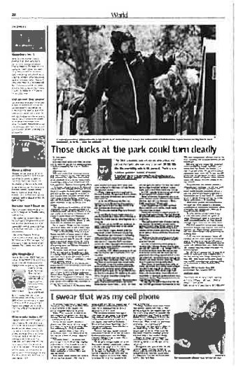
B) 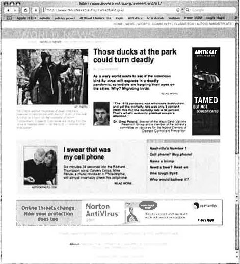

> Figure B-1.
> > Side-by-side of the "traditional narrative text" prototypes for A) print and B) online.

A) 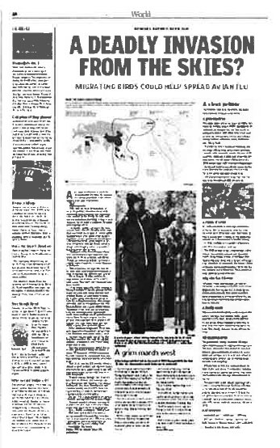
B) 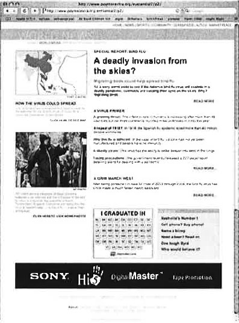

> Figure B-2.
> > Side-by-side of the "traditional text plus some alternative story forms" prototypes for A) print and B) online.

A) 
B) 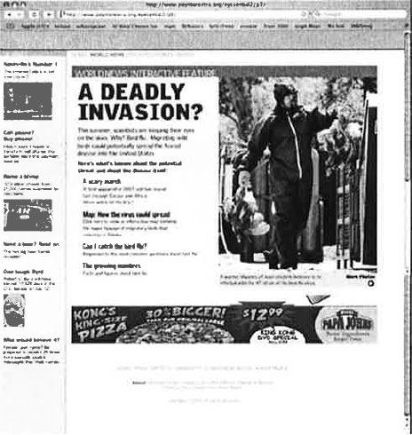

> Figure B-3.
> > Side-by-side of the "no traditional narrative text" prototypes for A) print and B) online.

---

# Appendix C
# Exit Interview Questionnaire

See handouts right now. In process of OCR scanning.

---

# List of References

Adam, P. S., Quinn, S., & Edmonds, R. (2007). *Eyetracking the news: A study of print and online reading*. St. Petersburg, FL: The Poynter Institute.

Agresti, A. (1996). *An introduction to categorical data analysis*. New York: Wiley.

Anderson, C. A. and Bushman, B. J. (2002). The effects of media violence on society. *Science*, 295(5564): 2377-2379.

ASL. (2007). Mobile eye: Lightweight tetherless eye tracking. Retrieved July 12, 2007, from <http://www.a-s-l.com/products/mobileeye.htm>

Babbie, E. R. (2004). *The practice of social research* (10th ed.). Belmont, CA: Wadsworth Thomson Learning.

Bakeman, R. & Brownlee, J. R. (1980). The strategic use of parallel play: A sequential analysis. *Child Development, 51*, 873-878.

Bakeman, R. & Gottman, J. M. (1997). *Observing interaction: An introduction to sequential analysis* (2nd ed.). Cambridge: Cambridge University Press.

Bakeman, R. & Quera, V. (1992). SDIS: A sequential data interchange standard. *Behavior Research Methods, Instruments & Computers, 24*(4), 554-559.

Bakeman, R. & Quera, V. (1995). *Analyzing interaction: sequential analysis with SDIS & GSEQ*. Cambridge: Cambridge University Press.

Bakeman, R. & Quera, V. (2008). GSEQ: Software for the Analysis of Interaction Sequences (Version 4.2) [Computer software].

Bandura, A. (1977). Self-efficacy: Toward a unifying theory of behavioral change. *Psychological Review*, 84(2): 191-215.

Brandt, S. A., & Stark, L. W. (1997). Spontaneous eye movements during visual imagery reflect the content of the visual scene. *Journal of Cognitive Neuroscience, 9*(1), 27.

Broadbent, D. E. (1958). *Perception and communication*. Oxford: Pergamon Press.

Bucher, H.-J., & Schumacher, P. (2006). The relevance of attention for selecting news content: An eye-tracking study on attention patterns in the reception of print and online media. *Communications: The European Journal of Communication Research, 31*(3), 347-368.

Burke, M., Hornof, A., Nilsen, E., & Gorman, N. (2005). High-cost banner blindness: Ads increase perceived workload, hinder visual search, and are forgotten. *ACM Transactions on Computer-Human Interaction, 12*(4), 423-445.

Cooke, L. (2005). Eye tracking: how it works and how it relates to usability. *Technical Communication, 52*(4), 456-463.

Chaffee, S. H. (1991). *Explication*. Newbury Park, CA: Sage.

Deutsch, J. A. and Deutsch, D. (1963). Attention: Some theoretical considerations. *Psychological Review*, 70(1): 80-90.

Dodge, K. A., Pettit, G. S. & Bates, J. E. (1994). Socialization mediators of the relation between socioeconomic status and child conduct problems. *Child Development*, 65(2): 649-665.

Duchowski, A. T. (2003). *Eye tracking methodology: theory and practice*. New York: Springer.

Durik, A. M., Vida, M. & Eccles, J. S. (2006). Task values and ability beliefs as predictors of high school literacy: A developmental analysis. *Journal of Educational Psychology*, 98(2): 382-393.

Eastman, C. (2000). New directions in design cognition: Studies of representation and recall. In C. Eastman, M. McCracken & W. Newstetter (Eds.), *Cognition in Design Education*: Elsevier.

Eccles, J. S., Adler, T. F., Futterman, R., Goff, S. B., Kaczala, C. M., Meece, J. & Midgley, C. (1983). Expectancies, values and academic behaviors. In J. T. Spence (Ed.), *Achievement and achievement motives* (pp. 75-146). San Francisco: Freeman.

Ellis, S. R., & Smith, J. D. (1985). Patterns of statistical dependency in visual scanning. In R. Groner, G. W. McConkie & C. Menz (Eds.), *Eye movements and human information processing* (pp. 221-238). Amsterdam: Elsevier.

Engebretsen, M. (2001). Hypernews and coherence. *Journal of Digital Information, 1*(7). Retrieved August 21, 2008, from <http://journals.tdl.org/jodi/article/view/jodi-26/27>

Fiske, S. T. and Taylor, S. E. (1984). *Social cognition*. Reading, MA: Addison-Wesley.

Garcia, M. R., & Stark, P. (1991). *Eyes on the news*. St. Petersburg, Fla.: Poynter Institute for Media Studies.

Geiger, S. F. and Reeves, B. (1999). "The effect of visual structure and content emphasis on the evaluation and memory for political candidates" in *Television and Political Advertising* (Frank Biocca ed.). Hillsdale, NJ: Lawrence Erlbaum.

Goldberg, J. H., & Kotval, X. P. (1999). Computer interface evaluation using eye movements: Methods and constructs. *International Journal of Industrial Ergonomics, 24*, 631-645.

Gottman, J. M. (1980). The consistency of nonverbal affect and affect reciprocity in marital interaction. *Journal of Consulting and Clinical Psychology, 48*, 711-717.

Gottman, J. M. (1983). How children become friends. *Monographs of the Society for Research in Child Development, 48*(3, Serial No. 201).

Gottman, J. M. & Bakeman, R. (1979). The sequential analysis of observational data. In M. E. Lamb, S. J. Suomi, & G. R. Stephenson (Eds.), *Social interaction analysis: Methodological issues* (pp. 185-206). Madison: University of Wisconsin Press.

Gottman, J. M. & Levenson, R. W. (1992). Marital processes predictive of later dissolution: Behavior, physiology, and health. *Journal of Personality and Social Psychology, 63*, 221-233.

Gottman, J. M. & Roy, A. K. (1990). *Sequential analysis: A guide for behavioral researchers*. Cambridge: Cambridge University Press.

Guthrie, J. T., Wigfield, A., Metsala, J. L. & Cox, K. E. (2000). Motivational and cognitive predictors of text comprehension and reading amount. *Scientific Studies of Reading*, 3(3): 231-256.

Hair, J., Black, W., Babin, B., Anderson, R., & Tatham, R. (2006). *Multivariate data analysis* (6th ed.). Upper Saddle River, NJ: Pearson.

Heimer, K. (1997). Socioeconomic status, subcultural definitions, and violent delinquency. *Social Forces*, 75(3): 799-833.

Holsanova, J., Rahm, H., & Holmqvist, K. (2006). Entry points and reading paths on newspaper spreads: Comparing semiotic analysis with eye-tracking measurements. *Visual Communication, 5*(1), 65-93.

Hoover-Dempsey, K. V. and Brissie, J. S. (1987). Parent involvement: Contributions of teacher efficacy school socioeconomic status, and other school characteristics. *American Educational Research Journal*, 24(3): 417-435.

Huesmann, R. L., Moise-Titus, J., Podolski, C.-L., & Eron, L.D. (2003). Longitudinal relations between children's exposure to tv violence and their aggressive and violent behavior in young adulthood: 1977-1992. *Development Psychology*, 39(2): 201-221.

James, W. (1981). *The principles of psychology* (Vol. 1). Cambridge, MA: Harvard University Press.

Josephson, S. (2004). A summary of eye-movement methodologies. Retrieved July 16, 2007, from <http://factone.com/article_2.html>

Josephson, S., & Holmes, M. E. (2002). Attention to repeated images on the World-Wide Web: Another look at scanpath theory. *Behavior Research Methods, Instruments, & Computers, 34*(4), 539.

Juhasz, B. J., Rayner, K. (2003). Investigating the Effects of a Set of Intercorrelated Variables on Eye Fixation Durations in Reading. *Journal of Experimental Psychology / Learning, Memory & Cognition, 29*(6), 1312.

Komogortsev, O., & Khan, J. (2006). *Perceptual attention focus prediction for multiple viewers in case of multimedia perceptual compression with feedback delay*. Paper presented at the ETRA, San Diego, CA.

Kwak, N. (1999). Revisiting the knowledge gap hypothesis: Education, motivation, and media use. *Communication Research*, 26(4): 385-413.

Lang, A. (2000). The limited capacity model of mediated message processing. *Journal of Communication*, 50: 46-70.

Lewenstein, M., Edwards, G., Tatar, D., & DeVigal, A. (2000). Stanford-Poynter Project: EyeTracking online news. Retrieved October 20, 2007, from <http://www.poynterextra.org/et/i.htm>

McAdams, M. & Berger, S. (2001). Hypertext. *Journal of Electronic Publishing, 6*(3). Retrieved August 21, 2008, from <http://hdl.handle.net/2027/spo.3336451.0006.301>

McConkie, G. W., & Loschky, L. C. (2002). Perception onset time during fixations in free viewing. *Behavior Research Methods, Instruments & Computers, 34*(4), 481-490.

Merritt, D. (2005). *Knightfall: Knight Ridder and how the erosion of newspaper journalism is putting democracy at risk*. New York, N.Y.: AMACOM--American Management Association.

Miller, D. C. (1991). *Handbook of research design and social measurement* (5th ed.). Newbury Park, Calif.: Sage Publications.

NAA. (2009). Total paid circulation. <http://www.naa.org/TrendsandNumbers/Total-Paid-Circulation.aspx>, last accessed May 2, 2009.

Nielsen, J. (2000). *Designing web usability: The practice of simplicity*. Indianapolis, Indiana: New Riders.

Nielsen, J. (2006). F-shaped pattern for reading Web content. *Jakob Nielsen's Alertbox*. Retrieved December 14, 2006, from <http://www.useit.com/alertbox/reading_pattern.html>

Noton, D., & Stark, L. (1971). Scanpaths in Saccadic Eye Movements While Viewing and Recognizing Patterns. *Vision Research, 11*, 929-942.

Outing, S., & Ruel, L. (2004). Eyetrack III: Online news consumer behavior in the age of multimedia. Retrieved October 20, 2007, from <http://poynterextra.org/eyetrack2004/>

Pan, B., Hembrooke, H., Gay, G., Granka, L., Feusner, M., & Newman, J. (2004). *The determinants of Web page viewing behavior: An eye-tracking study*. Paper presented at the Eye Tracking Research & Applications Symposium, New York.

Paik, H. and Comstock, G. (1994). The effects of television violence on antisocial behavior: A meta-analysis1. *Communication Research*, 21(4): 516-546.

Paul, N., & Ruel, L. (2007). Early lessons from Poynter's Eyetrack07. Online Journalism Review. Retrieved November 28, 2007, from <http://www.ojr.org/ojr/stories/070414paul/>

Petit, L., Orssaud, C., Tzourio, N., Mazoyer, B., & Berthoz, A. (1996). Do executed, imagined and suppressed saccadic eye movements share the same neuronal mechanisms in healthy human? In F. Lacquaniti & P. Viviani (Eds.), *Neural bases of motor behavior* (pp. 153-164). Dordrecht, Netherlands: Kluwer Academic Publishers.

Pieters, R., Rosbergen, E., & Wedel, M. (1999). Visual attention to repeated print advertising: A test of scanpath theory. *Journal of Marketing Research, 36*, 424-438.

Posner, M. I. (1969). "Abstraction and the process of recognition" in *The psychology of learning and motivation* (G. H. Bower & J. T. Spence eds.). New York: Academic Press.

Potter, W. J. (2008). The importance of considering exposure sates when designing survey research studies. *Communication Methods and Measures*, 2(1-2): 152-166.

Poynter Institute. (2007a). About Poynter. Retrieved November 29, 2007, from <http://www.poynter.org/column.asp?id=62>

Poynter Institute. (2007b). EyeTrack07 study for print and online news. Retrieved October 20, 2007, from <http://eyetrack.poynter.org>

Quinn, S. (2002). Knowledge management in the digital newsroom. Oxford, UK: Focal Press/Elsevier.

Rayner, K. (1978). Eye movements in reading and information processing. *Psychological Bulletin, 85*(3), 618-660.

Rayner, K., Sereno, S. C. & Raney, G. E. (1996). Eye movement control in reading: A comparison of two types of models. *Journal of Experimental Psychology / Human Perception & Performance, 22*(5), 1188.

Reingold, E. M., & Loschky, L. C. (2002). Saliency of peripheral targets in gaze-contingent multiresolutional displays. *Behavior Research Methods, Instruments & Computers, 34*(4), 491-499.

Rhee, J. W. & Cappella, J. N. (1997). The role of political sophistication in learning from the news; measuring schema development. *Communication Research*, 24(3): 197-233.

Riffe, D., Lacy, S., & Fico, F. (2005). *Analyzing media messages : using quantitative content analysis in research* (2nd ed.). Mahwah, N.J.: Lawrence Erlbaum.

Rosch, E. (1975). Cognitive representations of semantic categories. *Journal of Experimental Psychology*, 104(3): 192-233.

Salvucci, D. D. & Goldberg, J. H. (2000). *Identifying fixations and saccades in eye-tracking protocols*. Paper presented at the Eye Tracking Research & Applications Symposium, Palm Beach Gardens, FL.

Scheaffer, R. L., Mendenhall, W., & Ott, R. L. (2006). *Elementary survey sampling* (6th ed.). Belmont, CA: Thomson.

Shannon, C. E. and Weaver, W. (1949). *The mathematical theory of communication*. Urbana, IL: University of Illinois Press.

Singer, J. B. (2003). Who are these guys?: The online challenge to the notion of journalistic professionalism. *Journalism*, 4(2): 139-163.

Singer, J. B. (2005). The political j-blogger: 'normalizing' a new media form to fit old norms and practices. *Journalism*, 6(2): 173-198.

Stark, L. W. (1994). Sequences of fixations and saccades in reading. In J. Ygge & G. Lennerstrand (Eds.), *Eye movements in reading* (pp. 135-161). Tarrytown, NY: Pergamon.

Tao, C.-C., & Bucy, E. P. (2007). Conceptualizing media stimuli in experimental research: Psychological versus attribute-based definitions. *Human Communication Research, 33*(4), 397-426.

Tewksbury, D., Hals, M. L., & Bibart, A. (2008). The efficacy of news browsing: The relationship of news consumption style to social and political efficacy. *Journalism & Mass Communication Quarterly*, 85(2): 257-272.

Tichenor, P. J., Donohue, G. A. & Olien, C. N. (1970). Mass media flow and differential growth in knowledge. *Public Opinion Quarterly*, 34: 159-170.

Treisman, A. M. (1964). Selective attention in man. *British Medical Bulletin*, 20(1): 12-16.

Treisman, A., & Gelade, G. (1980). A feature integration theory of attention. *Cognitive Psychology, 12*, 97-136.

Treisman, A., Sykes, M. & Gelade, G. (1977). "Selective attention and stimulus integration" in *Attention and performance* (S. Dornic ed.). Hillsdale, NJ: Lawrence Erlbaum.

VideoLAN. (2008). VLC media player (Version 0.8.6) [Computer software].

Viswanath, K., Kahn, E., Finnegan, J. R., Jr., Hertog, J. & Potter, J. D. (1993). Motivation and the "knowledge gap": Effects of a campaign to reduce diet-related cancer risk. *Communication Research*, 20: 546-563.

Wei, William W. S. (2006). *Time series analysis: Univariate and multivariate methods* (2nd ed.). Boston: Pearson Education.

Wetzel, P. A., Armstrong Laboratory (U.S.). Aircrew Training Research Division., & Hughes Training Inc. Training Operations. (1997). *An eye tracking system for analysis of pilots' scan paths*. Mesa, Ariz.: Human Resources Directorate Aircrew Training Research Division.

White, D. M. (1950). 'The "Gate Keeper": A Case Study in the Selection of News', *Journalism Quarterly*, 27(3): 383-390.

Wicks, R. H. and Drew, D. G. (1991). Learning from news: Effects of message consistency and medium on recall and inference making. *Journalism Quarterly*, 68(1/2), 155-164.

Wiener, N. (1948). *Cybernetics : or, Control and communication in the animal and the machine*. New York: J. Wiley.

Wigfield, A. and Guthrie, J. T. (1997). Relations of children's motivation for reading to the amount and breadth of their reading. *Journal of Educational Psychology*, 89(3), 420-432.

Williams, T., Mulligan, C., Koprowicz, K., Miller, J., Reimann, C., & Wang, D.-S. (2005). Does isolating a visual element call attention to it? Results of an eye-tracking investigation of the effects of isolation on emphasis. *Technical Communication, 52*(1), 21-26.

Wimmer, R. D., & Dominick, J. R. (2006). *Mass media research: an introduction* (8th ed.). Belmont, CA: Thomson Wadsworth.

Wise, K., Bolls, P. & Schaefer, S. (2008). Choosing and reading online news: How available choice affect cognitive processing. *Journal of Broadcasting & Electronic Media*, 52(1), 69-85.

Yarbus, A. L. (1967). *Eye movements and vision*. New York: Plenum Press.

Zhu, Z., & Ji, Q. (2004). Eye and gaze tracking for interactive graphic display. *Machine Vision and Applications, 15*, 139-148.

---

# Biographical Sketch

David Stanton researches the relationships between design, behavior and cognition. He received his undergraduate and graduate degrees from the College of Journalism and Communications at the University of Florida. He is a professinal interface designer and media-prototype developer. Dave has a wife, Autumn, and two daughters, Lucy and Tabitha.

---

Discriminating News-Reading Behavior and Cognition Using Eye-Tracking Methodologies

David Stanton
Department of Journalism, College of Journalism and Communications
Supervisory chair: John Wright
Ph.D., mass communication
August 2013

The current study describes how design decisions affect the way people read and process news. It provides evidence that specific story forms can be used to help readers better remember news information. News organizations can use the findings to make design decisions that fit into reading patterns across print and digital news platforms.